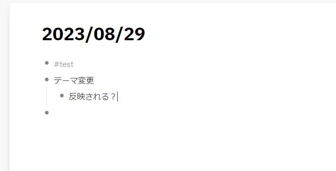

- #test
- テーマ変更
	- 反映される？
	- 
- ```python
  a = 3
  b = 2  # this is a comment
  c = "aaaa"
  ```
- testing
	- `aaa`
	- ^^aaa^^
	- **aaa**
	- *aaa*
	- $$aaa$$
- logseq記法とレンダリングテスト
	- **太字**
	- *斜体*
	- ~~取り消し~~
	- ^^ハイライト^^
	- $$E = mc^2$$
	- `code`
	- [Link to github](https://github.com/hachian/digital_garden)
	- ```python
	  a = 3
	  b = "123"
	  for i in range(10):
	    print(i)  # comment
	  
	  ```
	- 
	- #+BEGIN_QUOTE
	  aaaa
	  #+END_QUOTE
	- > aaa
	- #+BEGIN_NOTE
	  note
	  #+END_NOTE
	- #+BEGIN_TIP
	  tip
	  #+END_TIP
	- #+BEGIN_WARNING
	  warning
	  #+END_WARNING
	-