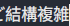
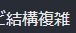
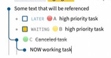
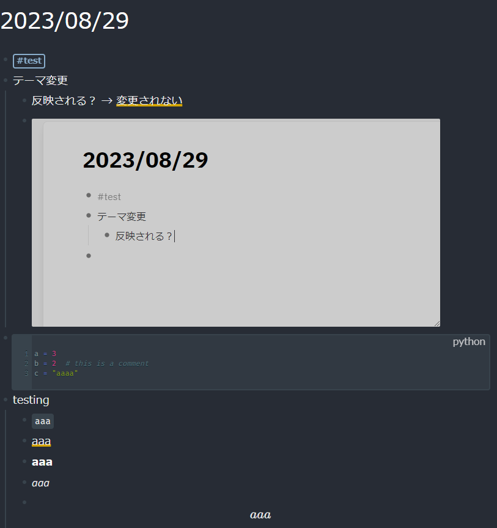
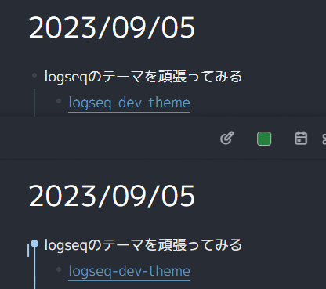
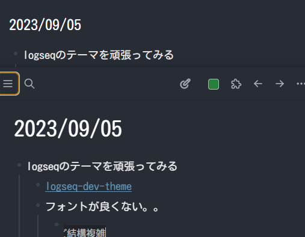
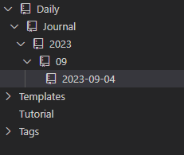

- [[markdown]] ページでプレビューを作成
  collapsed:: true
	- CSSをちょっといじる
- logseqのテーマを頑張ってみる
  collapsed:: true
	- [logseq-dev-theme](https://github.com/pengx17/logseq-dev-theme)
	- フォントが良くない。。
		- 
		- 日本語フォントを導入
			- 
			- `M PLUS 1p`を使用
			- ```css
			  /* This must be the first line of the custom.css with other import rules */
			  @import url("https://cdn.jsdelivr.net/gh/pengx17/logseq-dev-theme@main/custom.css");
			  
			  /* You can also add other styles below to override the default theme values */
			  @import url("https://fonts.googleapis.com/css?family=M+PLUS+1p");
			  :root {
			    --ls-font-family: "M PLUS 1p",
			  }
			  ```
	- なんかちょっとずれている
		- 
		- Githubの例を見るとずれていない
			- 
	- デプロイ
		- できた！
		- 
	- ブラウザでちょっとフォントがジャギっている
		- 上がブラウザで下がlogseq
		- 
		- rotateしてみたけど改善せず
		- id:: 64f7347e-516f-4e73-9aa9-dc7d650d7031
		  ```css
		  /* This must be the first line of the custom.css with other import rules */
		  @import url("https://cdn.jsdelivr.net/gh/pengx17/logseq-dev-theme@main/custom.css");
		  
		  /* You can also add other styles below to override the default theme values */
		  @import url("https://fonts.googleapis.com/css?family=M+PLUS+1p");
		  :root {
		    /* setting japanese font */
		    --ct-text-size: 18px;
		    --ls-font-family: "M PLUS 1p";
		    transform: rotate(0.03deg);
		  
		    /* setting about display NOT WORKING! */
		    --display-recent-pages: none;
		    --display-arrow-navigation: none;
		    --display-help-button: none;
		  }
		  ```
		- さらに、`--display-*`系も聞かない
		- まぁ、気にしないでいいか
		- フォント変更で解決
			- 上がブラウザで下がlogseq
			- 
				- 変更内容
				- ```diff
				  @@ -2,12 +2,11 @@
				   @import url("https://cdn.jsdelivr.net/gh/pengx17/logseq-dev-theme@main/custom.css");
				  
				   /* You can also add other styles below to override the default theme values */
				  -@import url("https://fonts.googleapis.com/css?family=M+PLUS+1p");
				  +@import url("https://fonts.googleapis.com/css2?family=Kosugi+Maru&display=swap");
				   :root {
				     /* setting japanese font */
				     --ct-text-size: 18px;
				  -  --ls-font-family: "M PLUS 1p";
				  -  transform: rotate(0.03deg);
				  +  --ls-font-family: "Kosugi Maru";
				  
				     /* setting about display NOT WORKING! */
				     --display-recent-pages: none;
				  ```
- [Dendron](https://wiki.dendron.so/)
  collapsed:: true
	- not for meだった。
	- 良い点
		- VSCodeなので書き心地は一番良い
	- 悪い点
		- Docsが不十分
			- メモツールはそんなに読まなくてもいいはずだけど結構複雑
		- なんか癖がある
			- Dailyの階層が深い…
				- 
			- プレビューのスクロール位置が同期しない
			- タグにジャンプできない
		- なんだかんだでVSCodeは起動時間かかる
	- アンインストール
		- 拡張機能をアンインストール
		- DendronのVaultとなっていたフォルダを削除