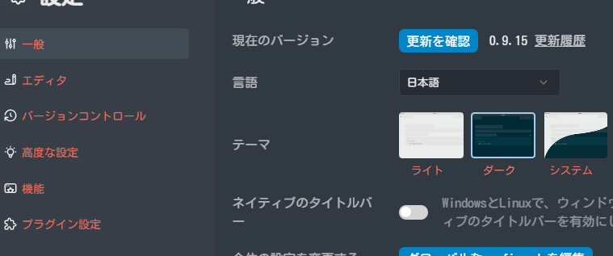

- blog技術選定 #blog
  collapsed:: true
	- [[Jekyll]]
		- [jekyll-theme-chirpy](https://github.com/cotes2020/jekyll-theme-chirpy)
	- [Astro](https://docs.astro.build/ja/tutorial/0-introduction/)
		- チュートリアルのブログ作成
		- [starlight](https://github.com/withastro/starlight)
		- [astro-paper](https://github.com/satnaing/astro-paper)
	- [[Nuxt]]
		- [alpine](https://github.com/nuxt-themes/alpine)
		- [docus](https://github.com/nuxt-themes/docus)
	- なんとなく一番ニーズに合っているのは**jekyll-theme-chirpy**ぽい
		- jekyllに疎いのが心配
		- Rubyもわからない、一度触ったことあるけどGemの管理だけでもググりながらやって遅かった
- なんかちょっとずれているのをなおす #logseq #css
	- https://github.com/pengx17/logseq-dev-theme/issues/95#issuecomment-1548026615
	- 続くコメントにある通り、-500pxが良かった
- [[logseq]]のcustom.cssをいじる #css
  collapsed:: true
	- [[Markdown]]にあてらえれるCSSを調整
	- 設定画面とかも色が変わってしまった。
		- 
	- 以下のように変更してなおった
		- ```css
		  /* Bold */
		  .content b,
		  .content strong {
		    color: var(--ct-warning-color);
		    font-weight: 600;
		  }
		  
		  /* Italic */
		  .content i,
		  .content em {
		    color: var(--ct-success-color);
		    font-style: normal;
		  }
		  ```
	-