- [jekyll-theme-chirpy](https://github.com/cotes2020/jekyll-theme-chirpy)環境構築 #Jekyll
  id:: 64fbc396-d331-4ad0-9762-588bc65a3ec2
	- RubyとJekyllをインストール
	  id:: 64fbc396-bf29-4348-9523-a2154f6654ba
	  collapsed:: true
		- https://jekyllrb.com/docs/installation/windows/
		- 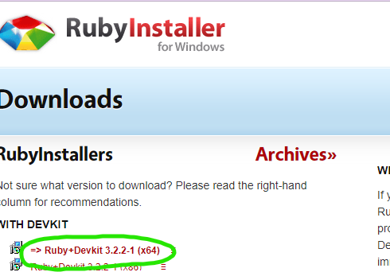
		- 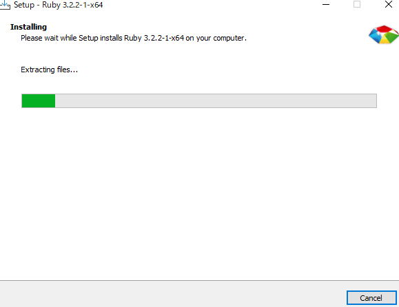
		- 意外と時間かかる
		- 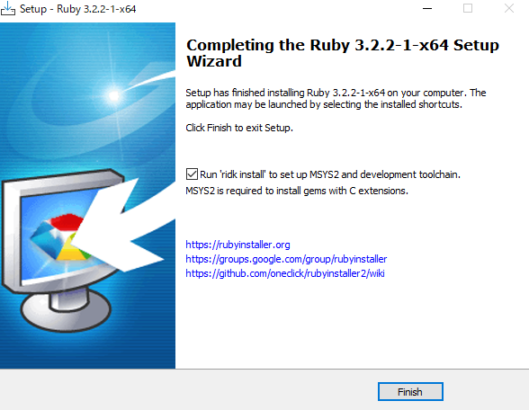
		- チェックはつけたままらしい
		- 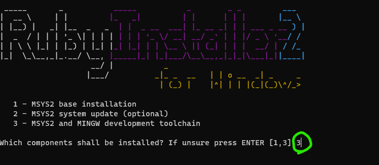
		- 3で`MSYS2 and MINGW development tool chain`を選択
		- 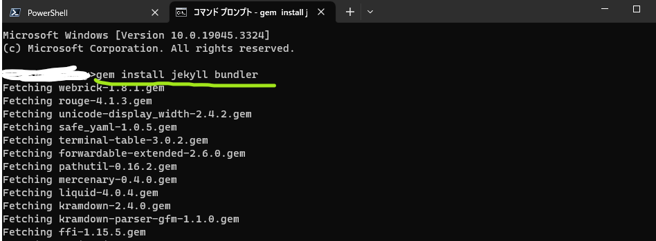
		- cmdで`gem install jekyll bundler`を実行
		- 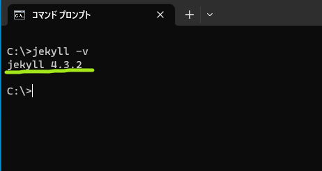
		- `jekyll -v`でバージョン確認
	- Gitをインストール
	  collapsed:: true
		- https://gitforwindows.org/
		- 持っているのでスキップ
	- `chirpy-starter`テンプレートを使用
	  id:: 64fbc396-ed89-418a-bc4f-797be0393bb3
	  collapsed:: true
		- https://github.com/cotes2020/chirpy-starter
		- 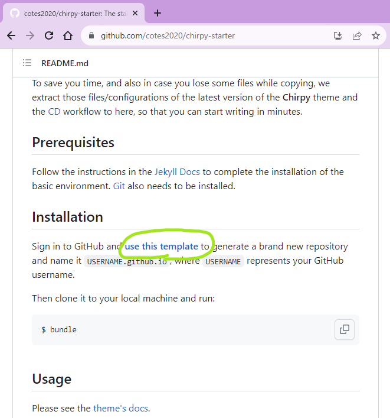
		- サイトの下のほうにある`use this template`をクリック
		- `USERNAME.github.io`という名前にするように書いてあったけど`chirpy-blog`にしちゃった
		-
	- git cloneしてbundle
	  collapsed:: true
		- 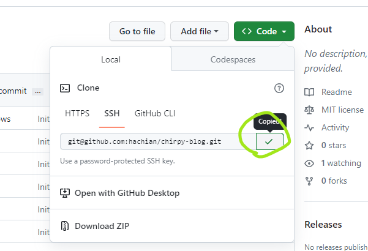
		- リポジトリをコピー
		- 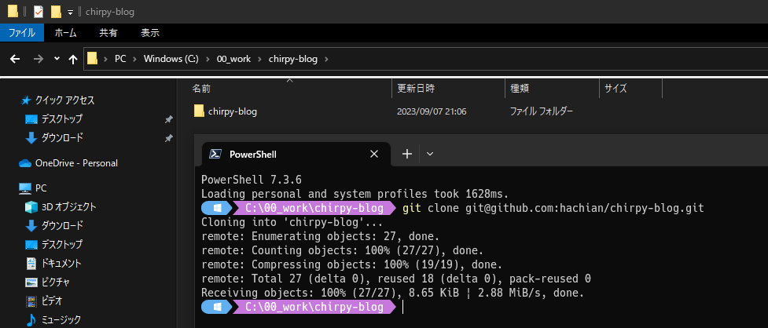
		- 適当なフォルダで以下のコマンド
		- `git clone git@github.com:hachian/chirpy-blog.git`
		- `cd chirpy-blog`
		- `bundle`
		- `bundle exec jekyll s`
		- [http://127.0.0.1:4000/](http://127.0.0.1:4000/)にアクセス
		- 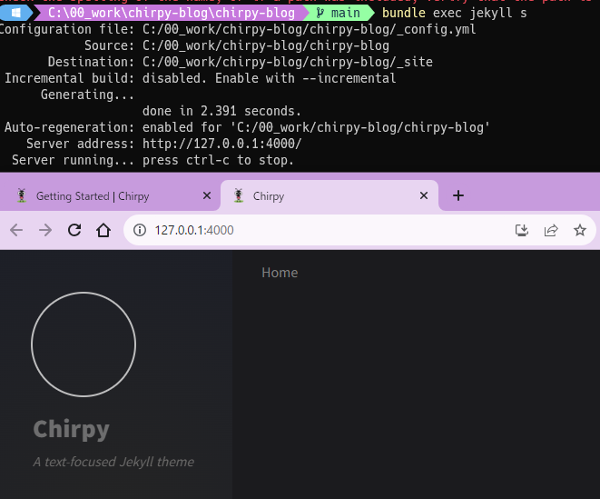
		- ブログができている
	- configを変更した
	  collapsed:: true
		- ドキュメントに書いてある通り、以下のコマンドを実行
			- `bundle lock --add-platform x86_64-linux`
			- `.gitignore`されているので意味あるのか？
		- https://github.com/hachian/chirpy-blog/commit/e13faf47f0def21e7ab32a553b2646e166f03e43
			- 上記コミットのように変更したら`Build and Deploy`に成功した
		- 諸々の変更
			- GitHub Pages
				- 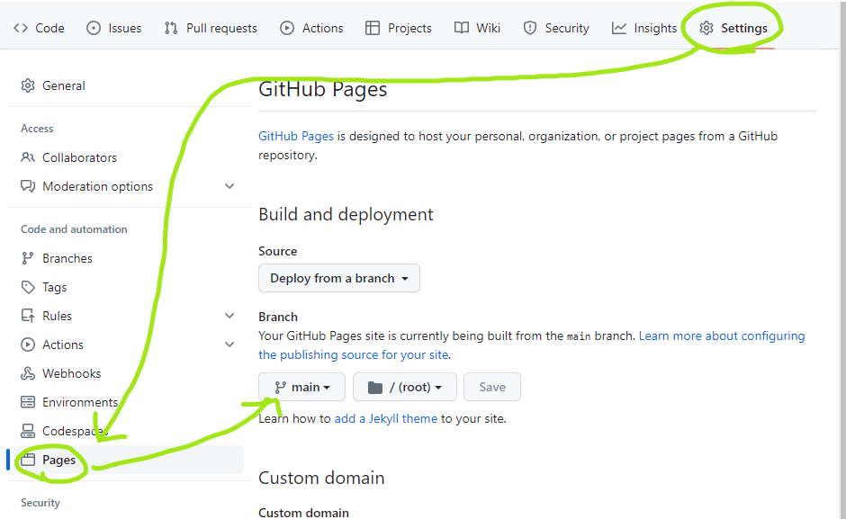
- ブログ記事を書く #blog
  collapsed:: true
	- https://chirpy.cotes.page/posts/write-a-new-post/
	- [[Markdown]]で記述
	- 画像貼り付けの場所を指定するために`.vscode/settings.json`を編集
		- ```.vscode/settings.json
		  {
		      "markdown.copyFiles.destination": {
		          "**/*.md": "${documentWorkspaceFolder}/assets/img/${documentBaseName}/"
		      }
		  }
		  ```
		- `/assets/imgs/【記事名】/image.png`みたいになる
		- マークダウン側には``のように相対パスで書かれるのでいちいち`..`を削除する
- GitHub PagesでのDeployがうまくいかない
  collapsed:: true
	- `baseurl`周りの設定が怪しい
		- ```_config.yml
		  baseurl: "/chirpy-blog"
		  url: "https://hachian.github.io"
		  ```
		- GitHub Actionsは問題ないけどサイトがこうなる
			- 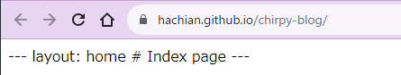
	- https://mademistakes.com/mastering-jekyll/site-url-baseurl/
		- 明日読んでみる
		- > 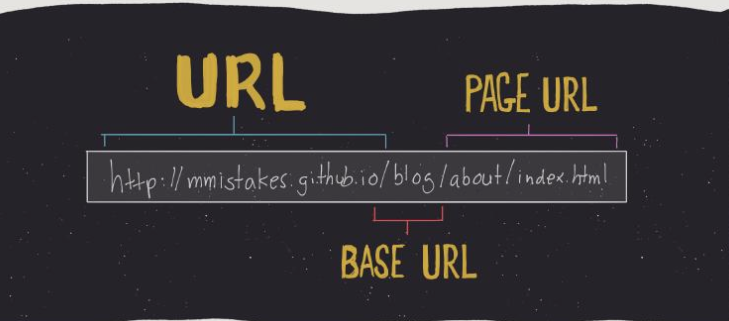
	-