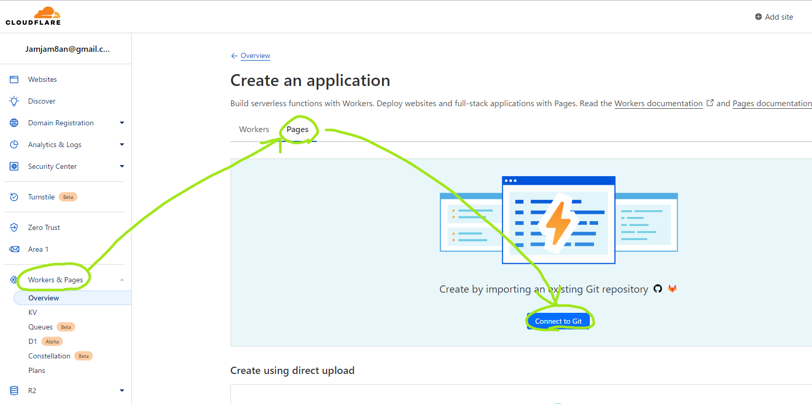

- jekyll-theme-chirpyのホスティングをGitHub PagesからCloudflare Hostingに変更
	- 参考URL
		- https://developers.cloudflare.com/pages/framework-guides/deploy-a-jekyll-site/
	- GitHubに上がっているところまで終わっている。
	- Deploying with Cloudflare Pagesから始める
		- 
		  id:: 64fbc396-1797-41b7-a742-8bde339bcf95
		- Gitに接続
		- 
		- 念のため、環境変数を設定
			- [Chirpyのチュートリアル](https://chirpy.cotes.page/posts/getting-started/#manually-build-and-deploy)の最後に書いてある
		- エラーが起きる
			- ```
			  21:48:08.103	Executing user command: jekyll build
			  21:48:09.660	/opt/buildhome/.asdf/installs/ruby/3.2.2/lib/ruby/gems/3.2.0/gems/bundler-2.4.19/lib/bundler/definition.rb:540:in `materialize': Could not find html-proofer-3.19.4, nokogiri-1.15.4-x86_64-linux, parallel-1.23.0, rainbow-3.1.1, typhoeus-1.4.0, yell-2.2.2, racc-1.7.1, ethon-0.16.0 in locally installed gems (Bundler::GemNotFound)
			  21:48:09.660		from /opt/buildhome/.asdf/installs/ruby/3.2.2/lib/ruby/gems/3.2.0/gems/bundler-2.4.19/lib/bundler/definition.rb:200:in `specs'
			  21:48:09.661		from /opt/buildhome/.asdf/installs/ruby/3.2.2/lib/ruby/gems/3.2.0/gems/bundler-2.4.19/lib/bundler/definition.rb:266:in `specs_for'
			  21:48:09.661		from /opt/buildhome/.asdf/installs/ruby/3.2.2/lib/ruby/gems/3.2.0/gems/bundler-2.4.19/lib/bundler/runtime.rb:18:in `setup'
			  21:48:09.661		from /opt/buildhome/.asdf/installs/ruby/3.2.2/lib/ruby/gems/3.2.0/gems/bundler-2.4.19/lib/bundler.rb:162:in `setup'
			  21:48:09.661		from /opt/buildhome/.asdf/installs/ruby/3.2.2/lib/ruby/gems/3.2.0/gems/jekyll-4.3.2/lib/jekyll/plugin_manager.rb:52:in `require_from_bundler'
			  21:48:09.662		from /opt/buildhome/.asdf/installs/ruby/3.2.2/lib/ruby/gems/3.2.0/gems/jekyll-4.3.2/exe/jekyll:11:in `<top (required)>'
			  21:48:09.662		from /opt/buildhome/.asdf/installs/ruby/3.2.2/bin/jekyll:25:in `load'
			  21:48:09.662		from /opt/buildhome/.asdf/installs/ruby/3.2.2/bin/jekyll:25:in `<main>'
			  21:48:09.667	Failed: Error while executing user command. Exited with error code: 1
			  21:48:09.677	Failed: build command exited with code: 1
			  21:48:10.724	Failed: error occurred while running build command
			  ```
			- `html-proofer-3.19.4`が見つからないみたいなエラー
			- [このコミット](https://github.com/hachian/chirpy-blog/commit/46346d278baa52909e7cb698eced4d269ffc142f)で解決
			- 7,9行目を削除するだけでよかったかも
	- GitHub Pagesの後片付け
	  collapsed:: true
		- GitHub Actionsを辞める
			- `.github/workflows/pages-deploy.yml`を削除
		- [Settings]->[Pages]->[Branch]を`None`にして`Save`
		- なんかアクセスできてしまうけどまぁいいか。
	- 出来上がったサイト
		- https://chirpy-blog.pages.dev/
		- URLが割と短いけどそんなもん？
	- 残作業
	  id:: 64fbc396-4fdc-490f-9ff3-1467d7a87e6d
		- DONE cssのカスタマイズ
		  id:: 64fbc396-abae-4a29-8505-eeeeb29885b5
		  collapsed:: true
			- DONE フォント変更 ← デプロイ時に適用できていない
				- jekyll-theme-chirpyの更新でなおした
			- DONE `H1`, `H2`, `em`, `strong`
		- DONE favicon
		- DONE vscodeのsnippet作成
		- DONE vscodeで投稿しやすくする
			- 投稿を自動で作成して、frontmatterを自動挿入までしてほしい
		- TODO 画像をwebp化、相対パス→絶対パスにする仕組みを作る
		- DONE ABOUTページ作成
		- DONE カスタムドメイン
		- DONE コメント
		- DONE [google_site_verification](https://search.google.com/search-console)
		  id:: 64fbc396-04e8-4635-9d43-03c497b513cd
		- DONE [google_analytics](https://analytics.google.com/analytics/web/#/p406343632/reports/intelligenthome)
-