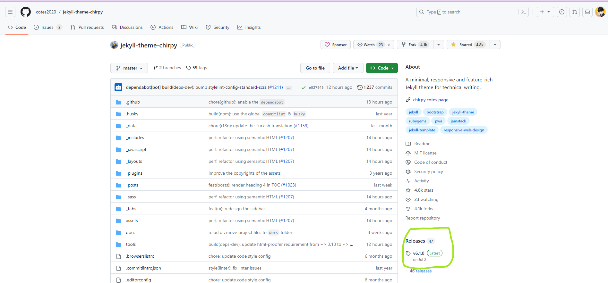
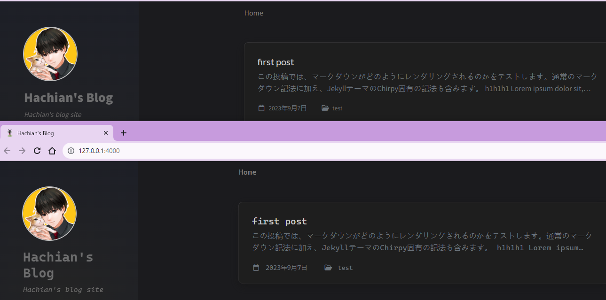
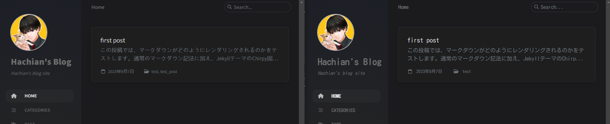
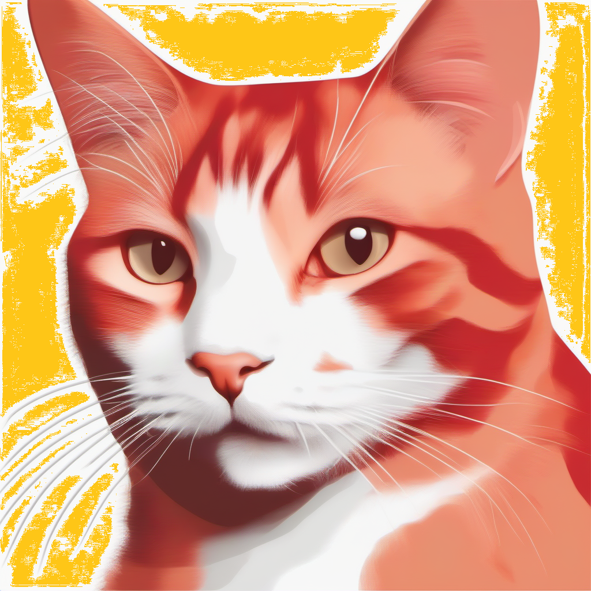
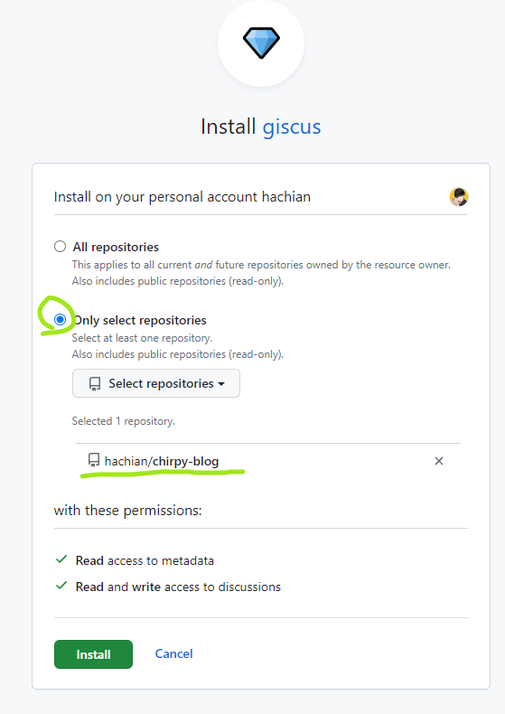

- 残作業をやっていく #Jekyll
	- {{embed ((64fbc396-4fdc-490f-9ff3-1467d7a87e6d))}}
	  id:: 64fbf31b-fae5-47a2-bb25-2c79499dc0d0
	- CSSの変更は[ここ](https://chirpy.cotes.page/posts/getting-started/#customizing-stylesheet)に書いてある
	  collapsed:: true
		- フォントの変更は[このissue](https://chirpy.cotes.page/posts/getting-started/#customizing-stylesheet)で対応されているのが参考になりそう
			- https://github.com/cotes2020/jekyll-theme-chirpy/pull/986
		- フォントは`_sass/addon/variables.scss`を変更？
		  collapsed:: true
			- ```scss
			  $font-family-base: 'Source Sans Pro', 'Microsoft Yahei', sans-serif !default;
			  $font-family-heading: Lato, 'Microsoft Yahei', sans-serif !default;
			  ```
			- 上記か？
		- `_sass`フォルダ全部取ってこないとだめだった。
			- [`master`](https://github.com/cotes2020/jekyll-theme-chirpy)の`_sass`フォルダはNG、表示が乱れる。
			- [chirpy-starter](https://github.com/cotes2020/chirpy-starter)と同じバージョンでなければならない
			- Releasesのところから取ってくる。今回だとv6.1.0
			- 
			  id:: 64fbffa2-ee11-4c64-995e-76d8fd848ab5
			- 以下の通りフォントの変更ができた。
			- ```diff
			  --- a/_sass/addon/variables.scss
			  +++ b/_sass/addon/variables.scss
			  @@ -23,5 +23,5 @@ $code-font-size: 0.85rem !default;
			  
			   /* fonts */
			  
			  -$font-family-base: 'Source Sans Pro', 'Microsoft Yahei', sans-serif;
			  -$font-family-heading: Lato, 'Microsoft Yahei', sans-serif;
			  +$font-family-base: 'Cascadia Code', 'Source Sans Pro', 'Microsoft Yahei', sans-serif;
			  +$font-family-heading: 'Cascadia Code', Lato, 'Microsoft Yahei', sans-serif;
			  ```
			- 
			- Google Fontsを使いたい
				- 左がBeforeで右がAfter
				- {:height 138, :width 630}
				  id:: 64fc064d-7cfd-41b1-a77a-a09167fe3071
		-
	- favicon([公式ドキュメント](https://chirpy.cotes.page/posts/customize-the-favicon/))
		- 公式ドキュメント通りにすればOK
		- SDXLで生成した。
		- `red white tabby cat icon`
			- 
			- 周りに色を差し込んだ
		- `browserconfig.xml`、`site.webmanifest`以外を`assets/img/favicons`に入れる
		- `browserconfig.xml`、`site.webmanifest`は本家リポジトリから持ってくる
	- コメント機能
	  collapsed:: true
		- disqus, utterances, giscusが用意されている。
		- 公式はgiscusぽいので、それに倣う
		- [giscusの始め方](https://giscus.app/ja)の通りにやったらできた。
			- 
			- GitHubのDiscussion機能をONにする。
		- (repo_idとかcategory_idとか見えてて大丈夫？)
			- ほかのサイトから勝手に自分のディスカッションにコメントされない？
			- まぁ、GitHubアカウント持っているかどうかでスパムは排除されるかな？
		-