- 残作業をやっている #Jekyll
	- カスタムドメイン
	  collapsed:: true
		- 設定できた: https://blog.hachian.com/
			- なんか表示遅いけど大丈夫？
				- 設定してから1日たたないから？
			- 元のアドレスでもアクセスできるけど重複ページとかにならない？
		- [Cloudflare](https://www.cloudflare.com/ja-jp/)側の設定
			- 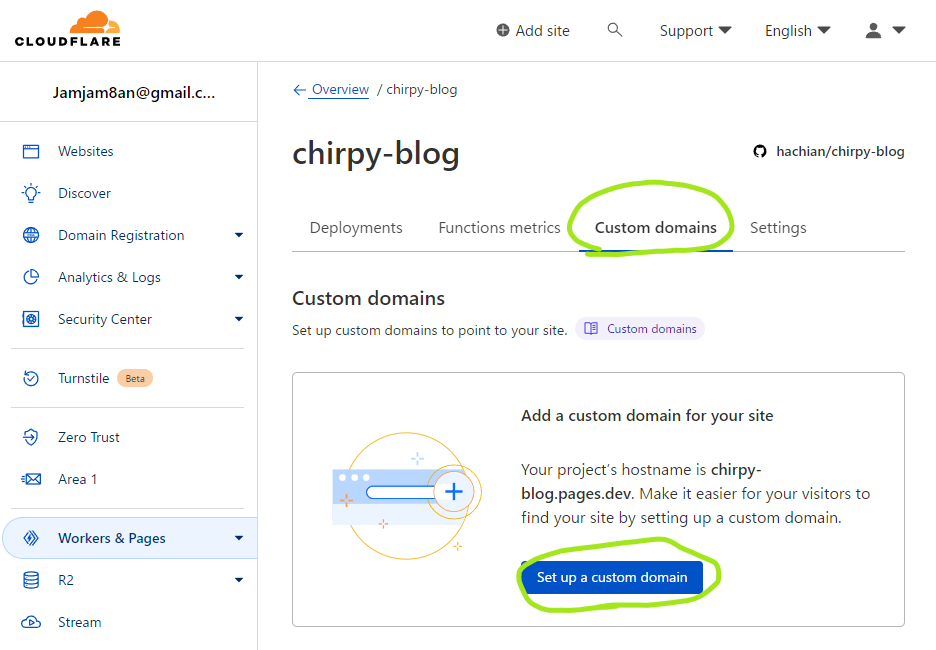
			- 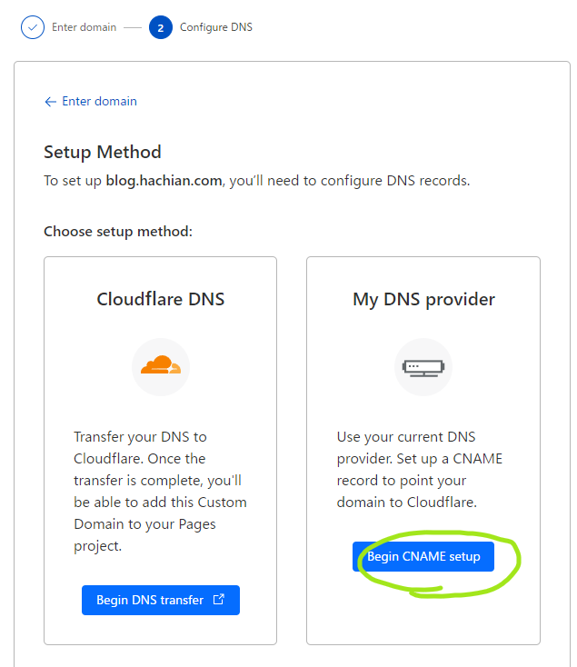
		- [AWS](https://aws.amazon.com/jp/console/) Route53側の設定
			- 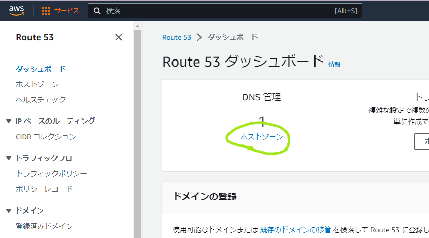
			- 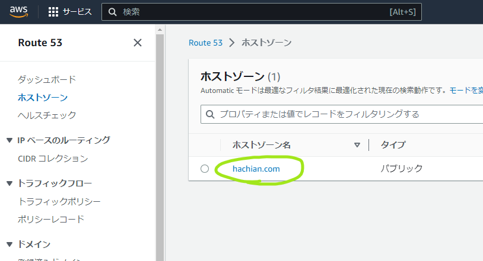
			- 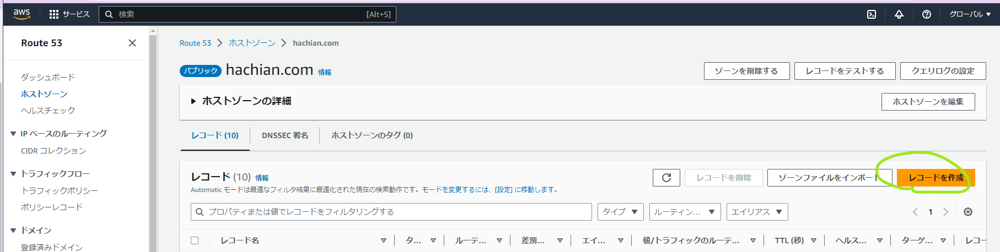
			- 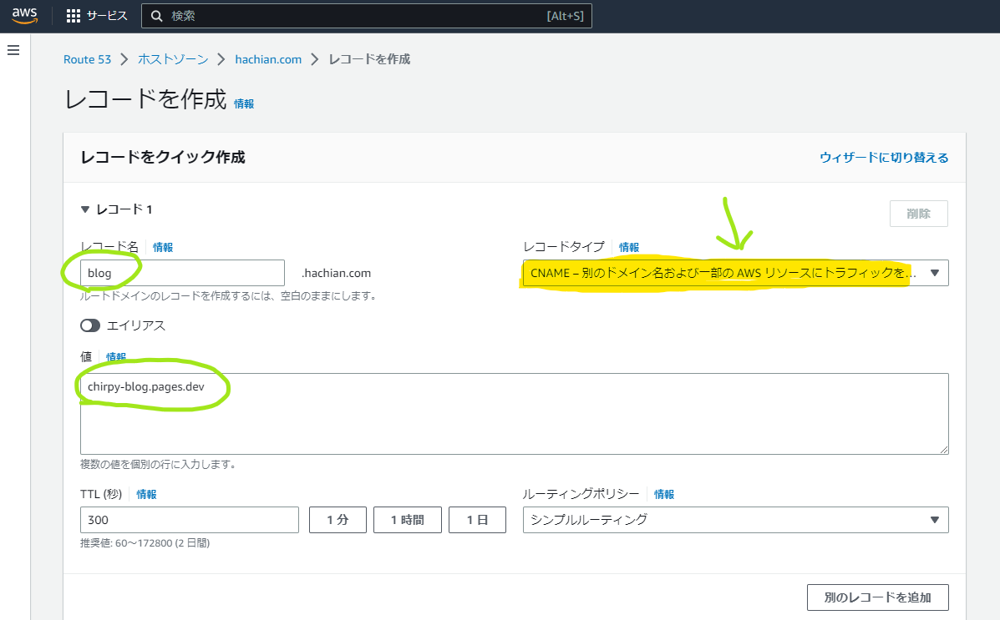
	- [google_site_verification](https://search.google.com/search-console)
	  collapsed:: true
		- 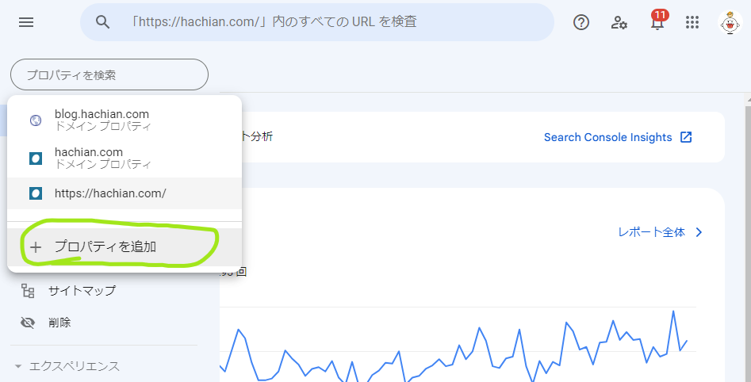
		- 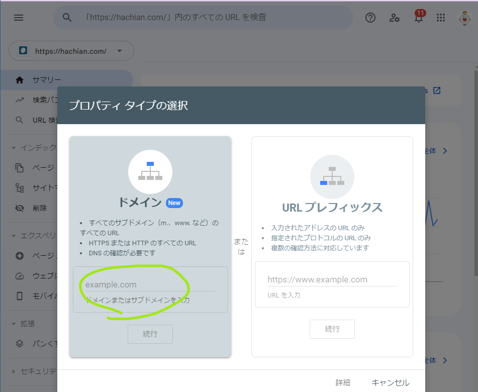
		- 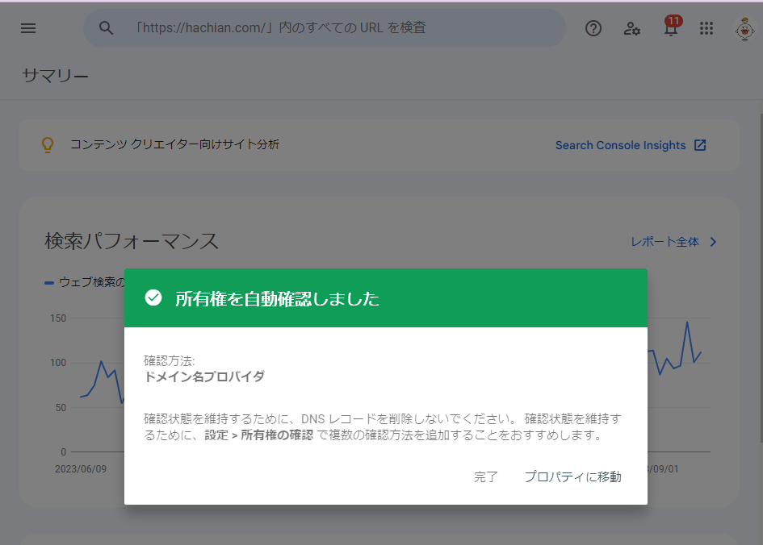
		- サブドメインだからか、所有権が自動で確認された。
		- `_config.yml`に`google_site_verification`があるが、何を設定するかわからない
		-
		-
	- google_analytics
	  collapsed:: true
		- 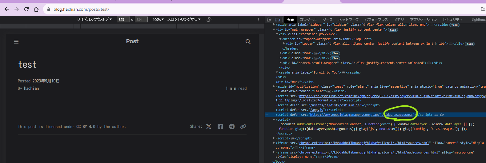
		- おそらくできている
	- フォントが戻っている…
	  collapsed:: true
		- Deploy先のみ、ローカルでは適用されている。
		- 上Deploy先、下ローカル、Deploy先には`Kosugi Maru`がない。
		- 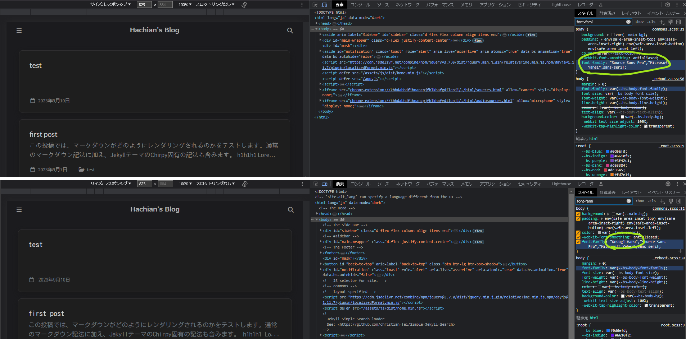
		- ちょうどchirpyも更新されている
			- https://github.com/cotes2020/jekyll-theme-chirpy
			- https://github.com/cotes2020/chirpy-static-assets
		- Jekyll本体の更新が原因だった。
			- 6.1 to 6.2のupdateで解消された。