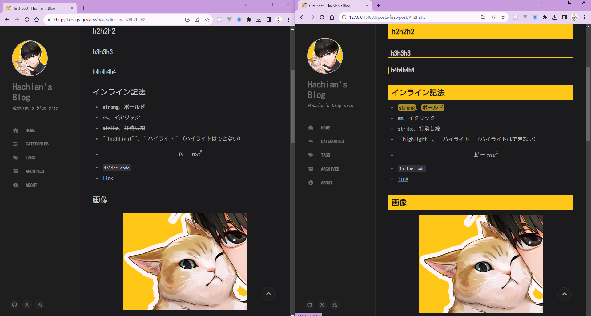

- 残作業やる #Jekyll
	- {{embed ((64fbc396-4fdc-490f-9ff3-1467d7a87e6d))}}
	  id:: 64fd9f62-d20e-49f7-8679-a0a1eb45066c
	- CSSのカスタマイズ
		- `_sass/main.scss`に書いた
			- 本来は簡単にカスタマイズできない。
			- 本来はJekyllのルールにのっとるのが原則
			- 基本的な構成が変わらないことを祈る。。
		- before/after
			- 
			-