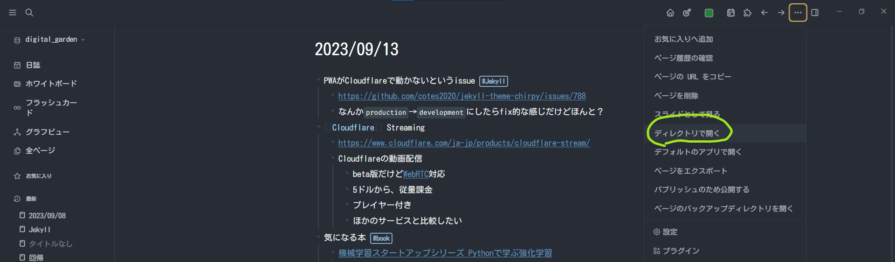

- PWAがCloudflareで動かないというissue #Jekyll
	- https://github.com/cotes2020/jekyll-theme-chirpy/issues/788
	- なんか`production`→`development`にしたらfix的な感じだけどほんと？
- [[Cloudflare]] Streaming
	- https://www.cloudflare.com/ja-jp/products/cloudflare-stream/
	- Cloudflareの動画配信
		- beta版だけど[WebRTC](https://developers.cloudflare.com/stream/webrtc-beta/#webrtc)対応
		- 5ドルから、従量課金
		- プレイヤー付き
		- ほかのサービスと比較したい
- 気になる本 #book
	- [機械学習スタートアップシリーズ Pythonで学ぶ強化学習](https://amzn.to/3rljDJv)
		- ヨドバシで買ったほうがきれいかも
		- [サンプルコード](https://github.com/icoxfog417/baby-steps-of-rl-ja)がちゃんとしている。
	- [「集合と位相」をなぜ学ぶのか](https://amzn.to/45O2TK8)
		- 持ってるから早く読もう
	- 詰ん読たち
		- 時間がない
		- ipad会社にもっていって読む？
- logseqフォルダ開き方
	- 適当にページを開く→右上の^^…^^からディレクトリで開く
		- 
	- これでGitHubへのpushが楽になる