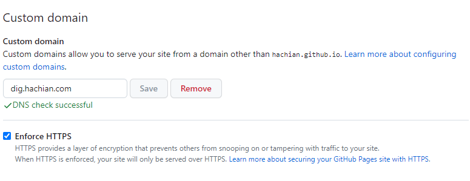

- GitHub Pagesのカスタムドメイン #GitHub
	- [logseq](https://github.com/hachian/digital_garden/settings/pages)のリポジトリの設定
		- カスタムドメインを設定：[http://dig.hachian.com/](http://dig.hachian.com/)
		- アクセスは可能
	- GitHubでエラーが出る。HTTPSできない
		- `NotServedByPagesError`
		- `InvalidDNSError`
		- {:height 300, :width 717}
		- DONE とりあえず時間をおいてみる
		  :LOGBOOK:
		  CLOCK: [2023-09-17 Sun 01:20:25]--[2023-09-17 Sun 13:11:42] =>  11:51:17
		  CLOCK: [2023-09-17 Sun 13:11:54]--[2023-09-17 Sun 14:29:45] =>  01:17:51
		  :END:
			- 12時間後、NG
			- 13時間後、行けたっぽい？
				- 
			- [公式ドキュメント](https://docs.github.com/ja/pages/configuring-a-custom-domain-for-your-github-pages-site/troubleshooting-custom-domains-and-github-pages#https-errors)
				- > カスタムドメインを設定した後、サイトが HTTPS 経由で利用可能になるには最長 1 時間かかります。
			- [stack overflow](https://stackoverflow.com/questions/54059217/how-to-fix-domain-does-not-resolve-to-the-github-pages-server-error-in-github)
				- > Just make sure you wait for the DNS Propagation to take effect which in some cases might take up to 24hrs.
			- [GitHub Community](https://github.com/orgs/community/discussions/35168)
				- > DNS propagation is not immediate. GitHub will not be able to tell you if your DNS configuration is good until it resolves from our side of the Internet.
			- 「まあ待て」的な回答が多い
			  background-color:: yellow
-