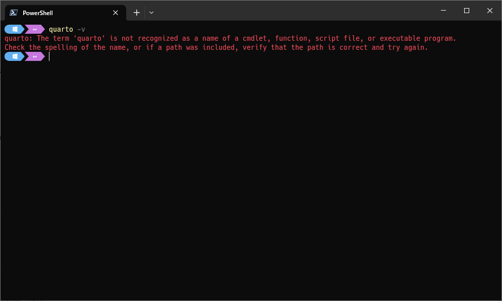
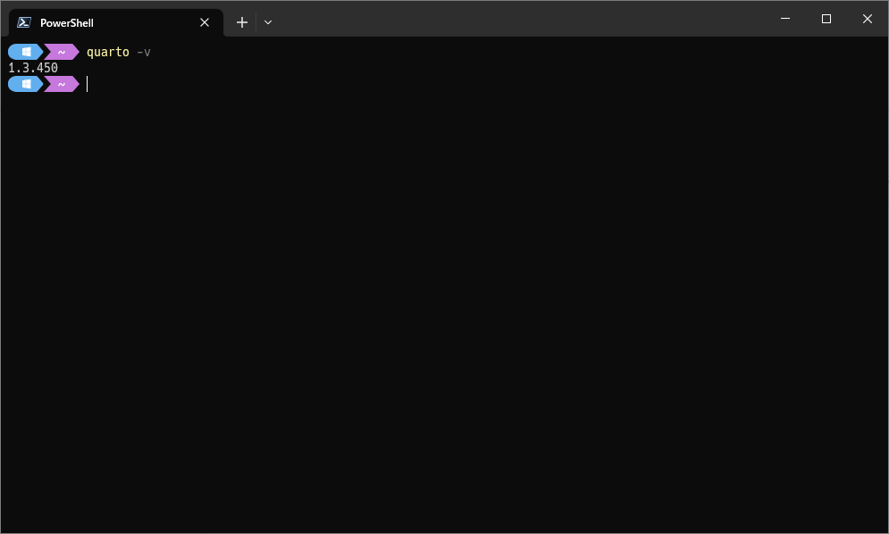
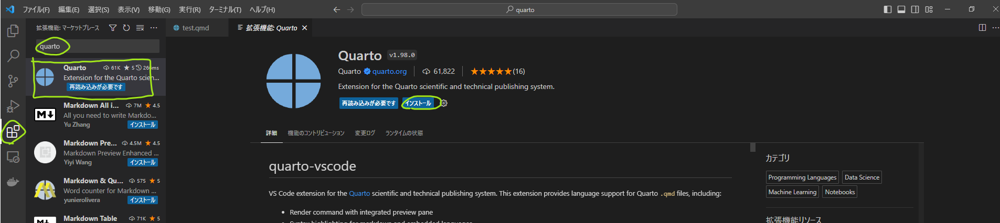
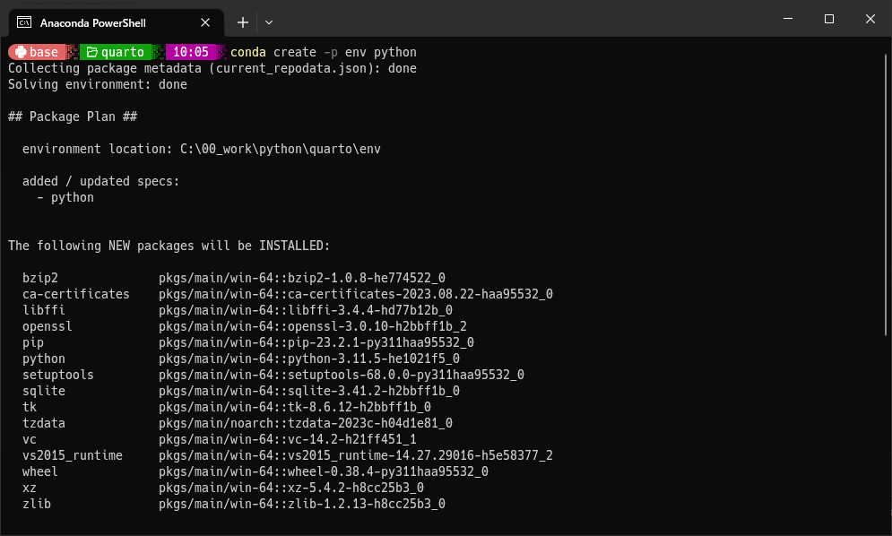
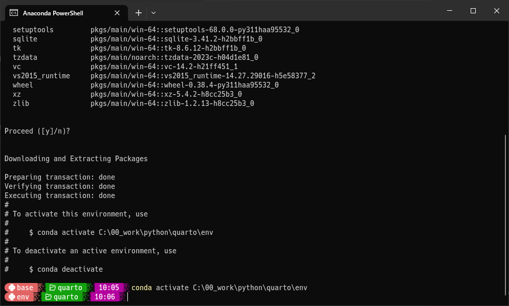
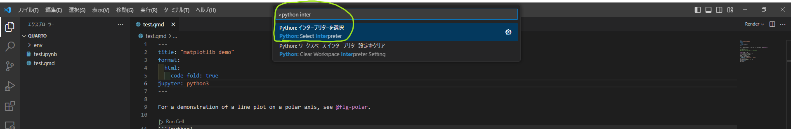
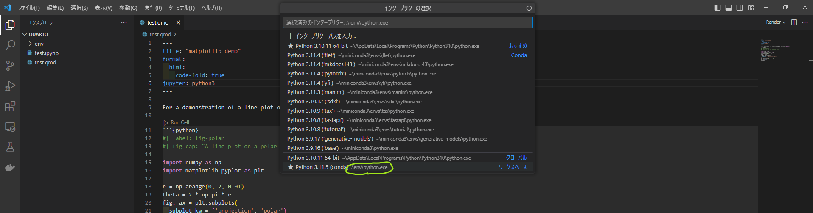
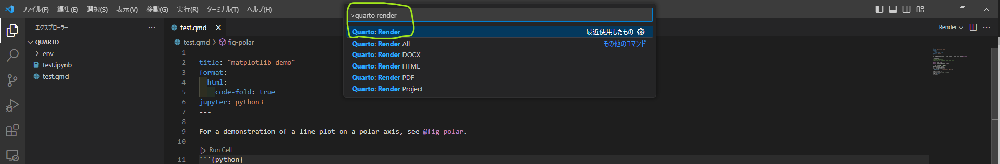
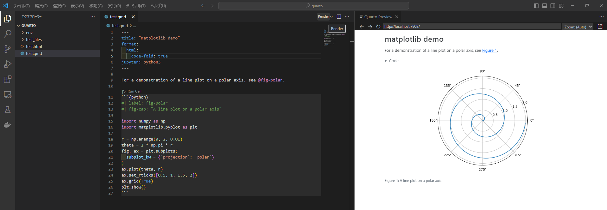

- [[Quarto]]
	- https://quarto.org/
	- Jupyter形式で記事が書ける
	- [[回帰]]のような記事はこっちで書いたほうがいいかも
	- 環境構築 #Quarto
		- DONE ブログ記事化
		  :LOGBOOK:
		  CLOCK: [2023-09-18 Mon 23:52:27]--[2023-09-20 Wed 22:56:42] =>  47:04:15
		  :END:
		- [Quarto CLI](https://quarto.org/docs/get-started/)をインストール
			- `quarto`コマンドが利用できるようになる
			- 
			- 
		- vscode拡張機能をインストール
			- 
		- conda環境を構築
			- [公式ドキュメント](https://quarto.org/docs/projects/virtual-environments.html#using-conda)
			- `conda create -p env python`
			- 
			- 指示通りに`conda activate`
			- 
		- vscode設定
			- インタープリターの選択
				- F1して`python interpreter`を検索、`インタープリターを選択`を選択
				- 
				- 出てきたインタープリターの一覧からさっき作ったインタープリターを選択する。
				- `.\env\python.exe`のはず
				- 
				- インタープリターがきちんと選択できていない場合：
					- `ModuleNotFoundError: No module named 'nbformat'`など、`ModuleNotFoundError`になる。
						- エラーメッセージの終わりにある通り、`activate`がちゃんとできていない。
							- *There is an unactivated Python environment in env. Did you forget to activate it?*
				- vscodeの再起動や再読み込み、PCの再起動もよい
		- テスト
			- [公式のテスト](https://quarto.org/docs/get-started/hello/vscode.html#render-and-preview)を走らせる
			- 
			- 