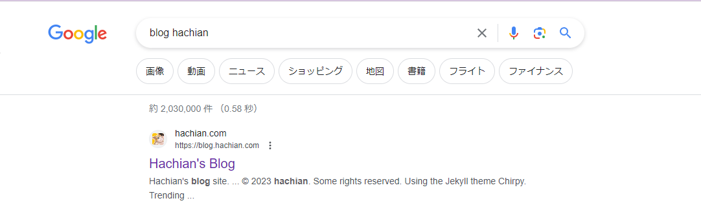

- Trading View #tradingview
	- 軽量チャート：https://github.com/tradingview/lightweight-charts
		- 株価情報は自分で持ってくる必要ありそう
- トレードのための機械学習 #GitHub
	- https://github.com/stefan-jansen/machine-learning-for-trading
	- 面白そうだけどLicenseがない
- [Rerender_A_Video](https://github.com/williamyang1991/Rerender_A_Video) #GitHub #AI
	- TODO [Rerender_A_Video](https://github.com/williamyang1991/Rerender_A_Video)試したい
	- 動画生成しても安定しているのが特徴
- `blog hachian`と検索して出るようになった #blog
	- 
	- Google Search Consoleでなんかボタンを押して、１日後になった気がするけどどんなボタンか忘れた
- [[blog]] 記事投稿
	- https://blog.hachian.com/posts/2023/09/21/quarto-vscode-conda/