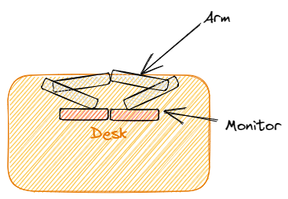
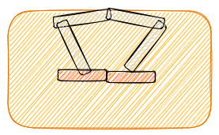
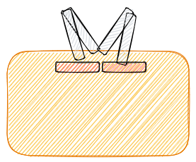

- モニターアーム設置
	- 多腕モニターアーム購入、設置した
		- 多腕という言葉、^^多腕バンディット問題^^でしか見たことないし、変換できない
	- 設置はかなり難しく、机を30cmほど前に動かすことになった
		- 顛末は下記の通り
		- 理想
			- 
		- 現実
			- 
		- 仕方なくこう
			- 
- digital gardenのデプロイ
	- 今日のデプロイはなにやら遅かった
	- 11分かかった
		- ふつうは3分程度
	- 更新をためすぎたか？