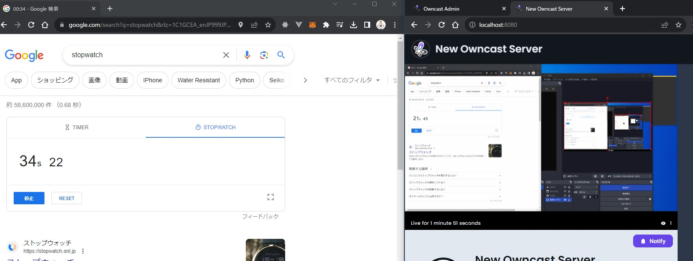

- DONE SSD増設
	- ブログ記事：https://blog.hachian.com/posts/2023/09/26/ssd/
- DONE NAS設定
	- TODO raspberry piからアクセスできるようにする
- [[Fediverse]]
	- {{embed ((65105f0f-030c-422b-9f57-f97f7826bd0a))}}
	- 動画系が気になる
		- [[Owncast]]は見たことある
			- 過去のlogseqより引用
			- owncast
				- https://owncast.online/quickstart/container/
					- 上記通りでdocker使ったインストールが可能
				- https://owncast.online/quickstart/startstreaming/
					- OBS設定は上記
					- 設定→サービスをカスタムに
					- 
				- {:height 256, :width 653}
					- オフラインなのに遅延がひどい13秒程度(なんで？)
		- DONE PeerTubeはStreamできるの？
			- 普通にできるポイ
			- https://docs.joinpeertube.org/use/create-upload-video