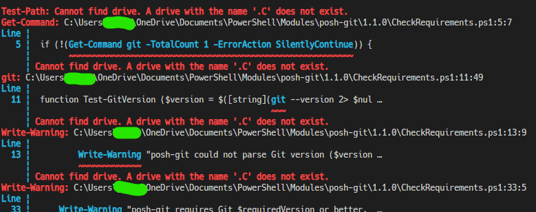
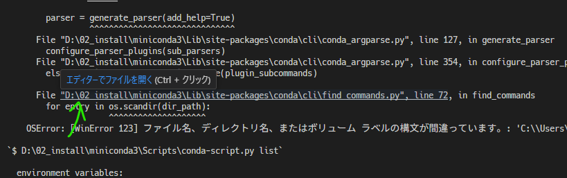
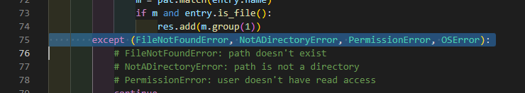
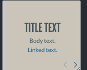
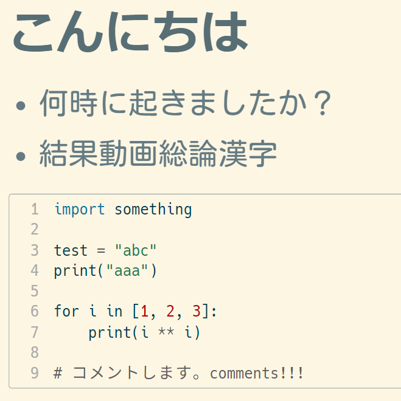

- TODO [[Astro]] 後で見る #Youtube
	- {{video https://youtu.be/e-hTm5VmofI}}
	- FreeCodeCampはここ最近、Next,Nuxt,Astroが立て続けに来ている
- エラー対応 #error
  collapsed:: true
	- ```
	  Test-Path: Cannot find drive. A drive with the name '.C' does not exist.
	  Get-Command: C:\Users\【ユーザ名】\OneDrive\Documents\PowerShell\Modules\posh-git\1.1.0\CheckRequirements.ps1:5:7
	  Line |
	     5 |  if (!(Get-Command git -TotalCount 1 -ErrorAction SilentlyContinue)) {
	       |        ~~~~~~~~~~~~~~~~~~~~~~~~~~~~~~~~~~~~~~~~~~~~~~~~~~~~~~~~~~~
	       | Cannot find drive. A drive with the name '.C' does not exist.
	  
	  ```
	- 
	- ~~上記のようなエラーの対処~~ **対処できなかった**
		- 参照していたconda環境を消したのが原因だった
		- リアルタイムに[バグ](https://github.com/microsoft/vscode-python/issues/22073#issuecomment-1734290798)も発生していたようだが、関係なかった
		- 結局Dドライブでconda環境作り直し
	- MiniCondaアンインストールとインストール
		- **MiniConda**だけの問題ではなかった
		- MiniCondaのインストールディレクトリを直接動かすことはできないので、公式の手順に従い、再インストールした
		- 特定の環境(vscodeのターミナル)でエラーが起こる
		- ```
		  # >>>>>>>>>>>>>>>>>>>>>> ERROR REPORT <<<<<<<<<<<<<<<<<<<<<<
		  
		      Traceback (most recent call last):
		        File "D:\02_install\miniconda3\Lib\site-packages\conda\exception_handler.py", line 17, in __call__
		          return func(*args, **kwargs)
		                 ^^^^^^^^^^^^^^^^^^^^^
		        File "D:\02_install\miniconda3\Lib\site-packages\conda\cli\main.py", line 54, in main_subshell
		          parser = generate_parser(add_help=True)
		                   ^^^^^^^^^^^^^^^^^^^^^^^^^^^^^^
		        File "D:\02_install\miniconda3\Lib\site-packages\conda\cli\conda_argparse.py", line 127, in generate_parser
		          configure_parser_plugins(sub_parsers)
		        File "D:\02_install\miniconda3\Lib\site-packages\conda\cli\conda_argparse.py", line 354, in configure_parser_plugins
		          else set(find_commands()).difference(plugin_subcommands)
		                   ^^^^^^^^^^^^^^^
		        File "D:\02_install\miniconda3\Lib\site-packages\conda\cli\find_commands.py", line 72, in find_commands
		          for entry in os.scandir(dir_path):
		                       ^^^^^^^^^^^^^^^^^^^^
		      OSError: [WinError 123] ファイル名、ディレクトリ名、またはボリューム ラベルの構文が間違っています。: 'C:\\Users\\【ユーザ名】\\AppData\\Roaming\\npmD:\\02_install\\miniconda3'
		  
		  ```
		- `OSError: [WinError 123] ファイル名、ディレクトリ名、またはボリューム ラベルの構文が間違っています。: 'C:\\Users\\【ユーザ名】\\AppData\\Roaming\\npmD:\\02_install\\miniconda3'`って…
			- 正：`npmD:\\`
			- 誤：`npm;D:\\`
			- こうでしょ。。
		- 4日前(2023/9/26くらい)からあるバグらしい、
		- https://community.anaconda.cloud/t/conda-and-anaconda-navigator-not-starting/61555/4
		- Ctrl+クリックで当該ファイルを開き、以下のように修正すればOK
		- 
		- 
- Quarto
  collapsed:: true
	- プレゼンに使えるrevealjsのテーマ
		- 一覧
		  collapsed:: true
			- |name|preview|
			  |beige||
			  |blood||
			  |dark|preview|
			  |default||
			  |league||
			  |moon||
			  |night||
			  |serif||
			  |simple||
			  |sky||
			  |solarized||
		- solarizedにするかぁ 
		- [テーマの変え方](https://quarto.org/docs/presentations/revealjs/themes.html)
		- フォントを変更しておこう
			- 指定は相対パスでやる`theme: [solarized, ../custom.scss]`
			- ```scss
			  /*-- scss:defaults --*/
			  
			  // fonts
			  $font-family-sans-serif: 'Kosugi Maru', "游ゴシック", sans-serif !default;
			  $font-family-monospace: "HackGen Console NF" !default;
			  
			  ```
			- ビフォー
				- 
			- アフター
				- 
			- vscodeが壊れているのでここまで。。
- slidev #vuejs
  collapsed:: true
	- 最新版でもう一度環境構築
	- NetlifyでDeployが失敗する
		- `netlify.toml`を更新する
		- ```diff
		  --- a/netlify.toml
		  +++ b/netlify.toml
		  @@ -1,5 +1,5 @@
		   [build.environment]
		  -  NODE_VERSION = "14"
		  +  NODE_VERSION = "18"
		  
		   [build]
		     publish = "dist"
		  ```
		- [公式リポジトリ](https://github.com/slidevjs/slidev/blob/main/netlify.toml)ではなおっているのでそのうちなおるでしょう
	- [blog](https://blog.hachian.com/)と同じ風なスタイルを適用
		- https://hachian-slidev-minimal.netlify.app/
	- [リポジトリ](https://github.com/hachian/slidev)はbranchごとに管理することにした
		- `minimal`リポジトリからcheckoutし、その日のスライドを作る