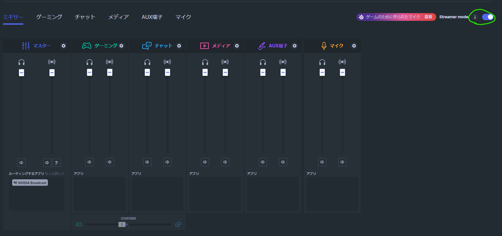
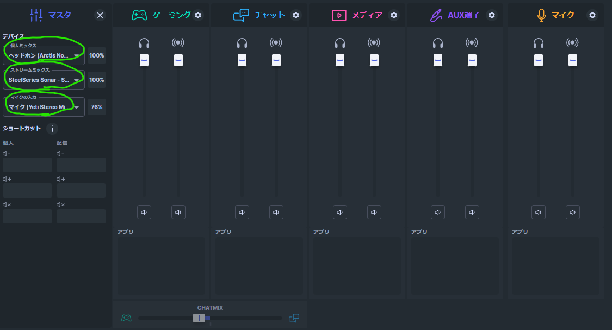

- [[Fediverse]]
	- 配信に向けローカル作業中`D:\00_work\slidev`
	- サムネ完成
		- 
	- 画像(ポンチ絵)作成中
- Sonar
	- 
	- 
- [[blog]]更新
	- https://blog.hachian.com/posts/2023/10/08/windows-group/
- slidev
	- 画像サイズはTailwind CSSを駆使して以下のように書ける。
	- ```html
	  
	  
	  ```
	- いまいちまだよくわかっていないが、いろんな画像で試して勘所をつかみたい