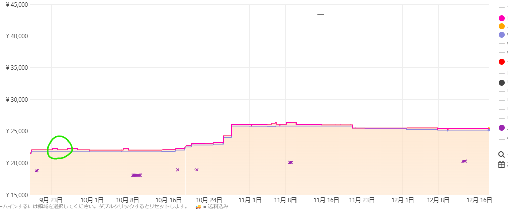

- miracast
	- 対応タブレット
		- https://kakaku.com/pc/pda/itemlist.aspx?pdf_Spec055=1&pdf_so=p1
	- 最安は8インチ12,980円
		- https://kakaku.com/item/K0001472937/
		- Matepadはplayストアが入らないらしい
	- 時間があれば実装できるかも
		- https://learn.microsoft.com/ja-jp/windows-hardware/design/device-experiences/wireless-projection-implementing-over-existing-network
- 格安泥tab #欲しいもの
	- xiaomi redmi pad
		- UVC対応らしい、ipadより全然安い
		- 4000円程度なら無印(SEなし)を買いたい
			- 
		- SEが発売したタイミングから無印が値上がりしている
			- 