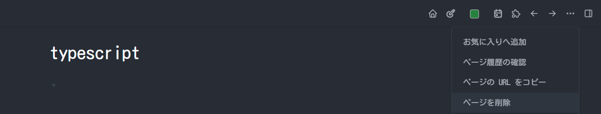

- キーボード #欲しいもの
	- 実家用・iPad活用のために欲しい
		- [FOLIO TOUCH](https://press.logicool.co.jp/ja-jp/toratsukupatsudoDaZaikibodoYiTiXingkesufolio-touchipad-airDi4ShiDaiYongwoFaMai/)があるが、使いづらい
		- 久しぶりに使ってみたが、そもそもiPadの入力体系が使いづらい
			- 変なタイミングで変換される
			- `Ctrl+Shift+A`みたいなことをすると謎の文字が入力される
			- Github Codespaceで文字がにじむ
			- Escapeがない
	- Keychron キークロン K8-91-WHT-Red-JP
		- bluetooth、メカニカル、赤軸、日本語配列
			- 見た感じまともな日本語配列
		- 13000円
		- 730g
		- https://www.yodobashi.com/product/100000001006717182/
	- HHKB studio
		- 44000円
		- 830g
		- https://www.pfu.ricoh.com/direct/hhkb/hhkb-studio/detail_pd-id120b.html
	- RealForceのキーキャップ
		- キーキャップの溝のホコリが気になるのでちょっとほしい
		- [amazon](https://www.amazon.co.jp/REALFORCE-%E3%83%AA%E3%82%A2%E3%83%AB%E3%83%95%E3%82%A9%E3%83%BC%E3%82%B9-%E3%82%AD%E3%83%BC%E3%83%9C%E3%83%BC%E3%83%89-%E3%82%AB%E3%83%A9%E3%83%BC%E3%82%AD%E3%83%BC%E3%82%AD%E3%83%A3%E3%83%83%E3%83%97%E3%82%BB%E3%83%83%E3%83%88-M0323J/dp/B0B6DQYBDV/ref=asc_df_B0B6DTX934/?tag=jpgo-22&linkCode=df0&hvadid=588939331149&hvpos=&hvnetw=g&hvrand=2682828444931542288&hvpone=&hvptwo=&hvqmt=&hvdev=c&hvdvcmdl=&hvlocint=&hvlocphy=1009306&hvtargid=pla-1720076500975&mcid=ce66ddbdda6f325792647b2a13dc9d5e&th=1)
	- 静音化
		- {{video https://www.youtube.com/watch?v=0lKSOfPjkwI}}
		- [amazon](https://www.amazon.co.jp/KURE-%E5%91%89%E5%B7%A5%E6%A5%AD-%E3%82%B7%E3%83%AA%E3%82%B3%E3%83%B3%E3%82%B0%E3%83%AA%E3%83%BC%E3%82%B9%E3%83%A1%E3%82%A4%E3%83%88-1067-HTRC2-1/dp/B001D2CVCY/ref=sr_1_2?__mk_ja_JP=%E3%82%AB%E3%82%BF%E3%82%AB%E3%83%8A&crid=265BW6923IBAP&keywords=%E3%82%AF%E3%83%AC%2B%E3%82%B0%E3%83%AA%E3%82%B9&qid=1703600452&s=automotive&sprefix=%E3%82%AF%E3%83%AC%2B%E3%82%B0%E3%83%AA%E3%82%B9%2Cautomotive%2C150&sr=1-2&th=1)
		- はけとピンセットも
- [[タグ整理]]
	- logseqのタグ仕様
		- 大文字小文字の区別はない
		- 最初に作った名前に統一される
			- `PyTorch`でタグを作った後`pytorch`タグを作ると`PyTorch`に吸収される
		- ので、最初に作るときだけちょっと気にする。
		- 間違った場合はタグのページに行って、…からページを削除
			- 
			-
	- お買い物系
		- #欲しいもの
		- #MyNewGear
	- 参照系
		- #book
			- 読み始めたらその本のタイトルにしておいたほうがよい
		- #youtube
		- #github
	- 技術系
		- #blog
		- #AI
		- #vscode
		- #Astro #PyTorch など、技術の名前or略称にする