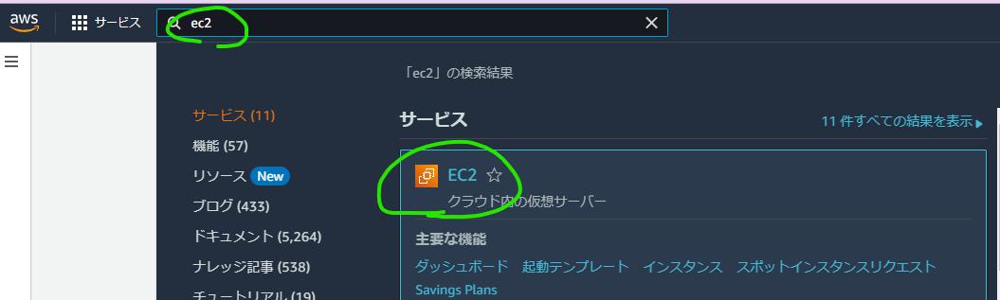

- AWSでパルワールド
	- EC2
		- 
		- 
		- これはダメ、Armじゃダメ…高いけど。。
		- 
		- キーペア
			- 
			- 実質使わない
		- インスタンスを起動
	- ポート開放
		- インスタンスからインスタンスIDをクリック
		- セキュリティタブのセキュリティグループを開く
		- インバウンドのルールを編集→ルールを追加
			- カスタムUDP-27015(query)
			- カスタムUDP-8211(game)
	- コマンド
		- 最初に
			- `sudo -i`
			- `apt update`
			- `apt upgrade -y`
		- ポート開放
			- `ufw enable` → y
			- `ufw limit 22`
			- `ufw allow 8211`
			- `ufw allow 27015`
		- dockerインストール
			- https://docs.docker.com/engine/install/ubuntu/
			- `apt install ca-certificates curl gnupg`
			- `curl -fsSL https://download.docker.com/linux/ubuntu/gpg | sudo gpg --dearmor -o /etc/apt/keyrings/docker.gpg`
			- `chmod a+r /etc/apt/keyrings/docker.gpg`
			- ```sh
			  echo \
			    "deb [arch=$(dpkg --print-architecture) signed-by=/etc/apt/keyrings/docker.gpg] https://download.docker.com/linux/ubuntu \
			    $(. /etc/os-release && echo "$VERSION_CODENAME") stable" | \
			    sudo tee /etc/apt/sources.list.d/docker.list > /dev/null
			  
			  ```
			- `apt update`
			- `sudo apt-get install docker-ce docker-ce-cli containerd.io docker-buildx-plugin docker-compose-plugin`
		- ここでrootを`exit`する
		- docker file
			- `nano kick.sh`
			- 貼り付け
			- ```
			  sudo docker run -d \
			      --name palworld-server \
			      -p 8211:8211/udp \
			      -p 27015:27015/udp \
			      -v ./palworld:/palworld/ \
			      -e PLAYERS=32 \
			      -e PORT=8211 \
			      -e PUID=1000 \
			      -e PGID=1000 \
			      -e COMMUNITY=false \
			      --restart unless-stopped \
			      thijsvanloef/palworld-server-docker
			  sudo docker start palworld-server
			  ```
			- `Ctrl+X`→`Y`→`Enter`
			- `chmod +x kick.sh`
		- 起動時実行
			- `sudo mv kick.sh /etc/init.d/`
			- `sudo update-rc.d kick.sh defaults`
	- Erastic IPでIP固定 (起動時にお知らせしてくれるぼっと作ればいらない 3ドルくらい？)
	-
- AWS料金探す
	- https://instances.vantage.sh/?region=ap-northeast-1