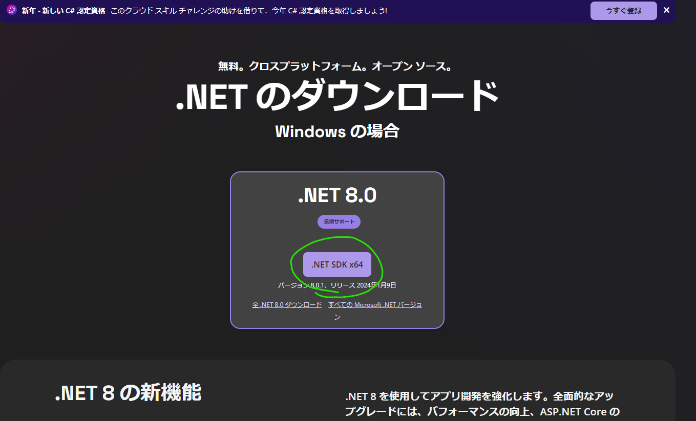
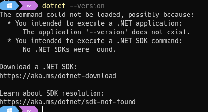
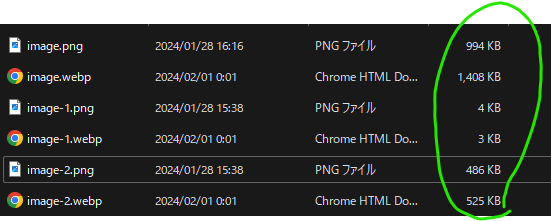

- png→webp
	- ~~dotnet　(しなくてOKだった。)~~
	  collapsed:: true
		- [ダウンロード](https://dotnet.microsoft.com/ja-jp/download)
		- 
		- インストールしなくても大丈夫だった
		- 
	- スクリプト
		- ```Powershell
		  Add-Type -AssemblyName System.Drawing
		  Get-ChildItem -Path '.\*.png'|
		  ForEach-Object{$img =[System.Drawing.Image]::FromFile($_.fullname);
		  $img.Save($(-join((join-path $_.DirectoryName $_.BaseName),".webp")),[System.Drawing.Imaging.ImageFormat]::Webp)}
		  ```
	- 出来上がったwebpがpngより重い
		- なぜ？
		- 
	- [libwebp](https://developers.google.com/speed/webp/docs/precompiled?hl=ja)を使う
	- スクリプト
		- ```powershell
		  $ENV:Path+=";PATH\TO\LIBWEBP\libwebp-1.3.2-windows-x64\bin"
		  
		  Get-ChildItem public\imgs -Recurse -Include *.png |
		  %{ cwebp.exe -lossless -metadata icc $_.FullName -o ([System.IO.Path]::ChangeExtension($_.FullName,".webp")) }
		  ```
	- ファイルサイズ小さくなった
		- 
		- まぁ、こんなもん…？