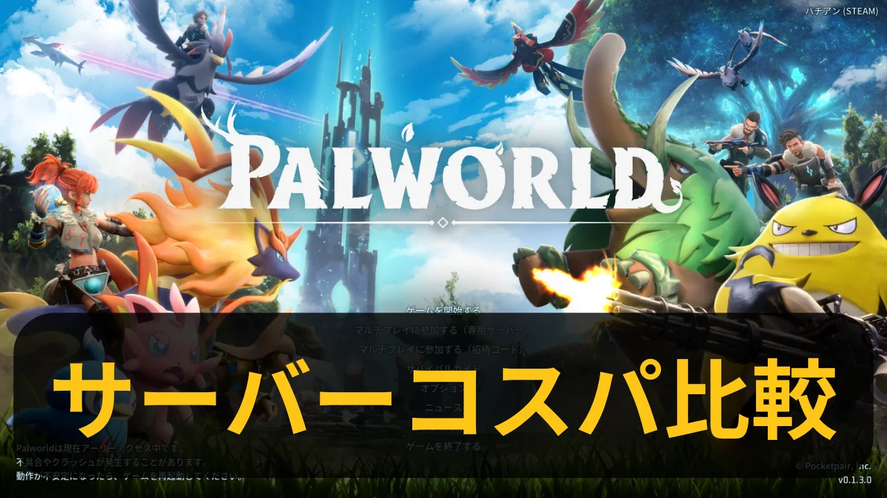

- webp化、サイズどのくらい小さくなるか
  id:: 65ba60a3-1dd9-4894-a2ed-a093ddc9ae8a
	- スクリプト
		- ```powershell
		  $ENV:Path+=";D:\00_work\astro\20240127_blog\ignore\libwebp-1.3.2-windows-x64\bin"
		  
		  Get-ChildItem public\imgs -Recurse -Include *.png |
		  ForEach-Object{
		      $parentDir = Split-Path $_.FullName -Parent;
		      $stem = [System.IO.Path]::GetFileNameWithoutExtension($_.FullName);
		  
		      # lossless
		      $filename = "{0}_lossless.webp" -f $stem;
		      $outpath = Join-Path $parentDir $filename
		      cwebp.exe -lossless -metadata icc $_.FullName -o $outpath
		  
		      # jpeg_like
		      $filename = "{0}_jpeg_like.webp" -f $stem;
		      $outpath = Join-Path $parentDir $filename
		      cwebp.exe -jpeg_like -metadata icc $_.FullName -o $outpath
		  
		      # near_lossless 
		      $filename = "{0}_near_lossless.webp" -f $stem;
		      $outpath = Join-Path $parentDir $filename
		      cwebp.exe -near_lossless 60 -metadata icc $_.FullName -o $outpath
		  
		      # resize
		      $filename = "{0}_resize.webp" -f $stem;
		      $outpath = Join-Path $parentDir $filename
		      cwebp.exe -resize 720 0 -metadata icc $_.FullName -o $outpath
		  
		      # psnr
		      $filename = "{0}_psnr.webp" -f $stem;
		      $outpath = Join-Path $parentDir $filename
		      cwebp.exe -psnr 50 -metadata icc $_.FullName -o $outpath
		  
		      # Remove-Item $_.FullName
		  }
		  ```
	- `lossless`-`near_lossless`-`psnr(50)`-`jpeg_like`の順
		- ファイルサイズ[KB] 元1309、944、677、260、112 (画像は折り畳み)
		  collapsed:: true
			- 
			- 
			- 
			- 
	- `lossless`-`near_lossless`-`psnr(50)`-`jpeg_like`の順
		- ファイルサイズ[KB] 元53、18、18、72、63 (画像は折り畳み)
		  collapsed:: true
			- 
			- 
			- 
			- 
	- ブログサムネイル(ゲームスクショ)は`jpeg_like`でも見れるし、ファイルサイズ小さい
	- ターミナル画面は`psnr`と`jpeg_like`だと**画質落ちるし、ファイルサイズ大きい**
	-