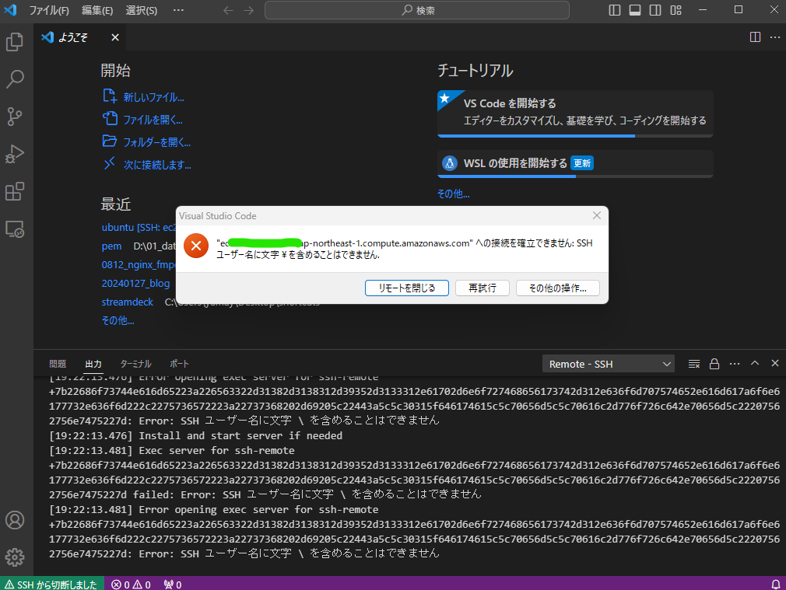

- pemのchmod
  id:: 65c2469d-e2b4-47b8-abba-cbe7d70e1852
	- https://gist.github.com/jaskiratr/cfacb332bfdff2f63f535db7efb6df93
	- ```sh
	  # Source: https://stackoverflow.com/a/43317244
	  $path = ".\aws-ec2-key.pem"
	  # Reset to remove explict permissions
	  icacls.exe $path /reset
	  # Give current user explicit read-permission
	  icacls.exe $path /GRANT:R "$($env:USERNAME):(R)"
	  # Disable inheritance and remove inherited permissions
	  icacls.exe $path /inheritance:r
	  ```
- エラー
  id:: 65c2469c-9df5-4a91-b76b-77192f504890
	- `ssh -i "D:\01_data\pem\pal-world.pem" ubuntu@ec2-18-181-95-131.ap-northeast-1.compute.amazonaws.com`
	- 
-