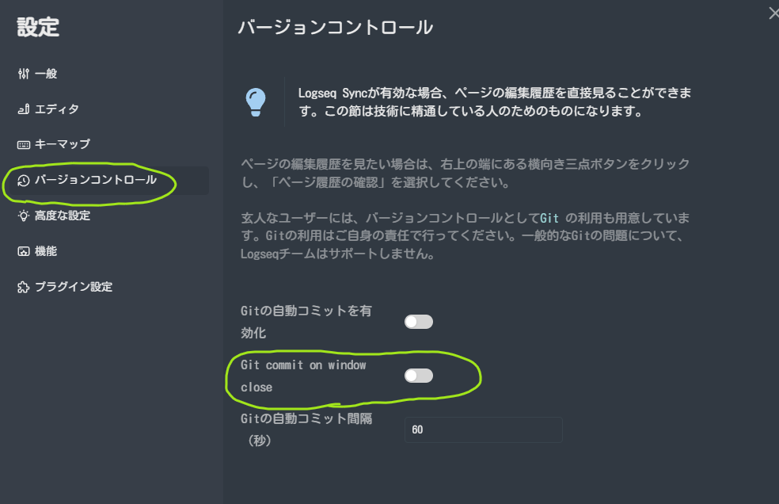

- logseqの`commit`と`push`
	- 設定→バージョンコントロールに`Git commit on window close`という設定項目が来てた
	  collapsed:: true
		- 
	- Windowを閉じたときに`Auto saved by Logseq`というメッセージでコミットされる
	- しかし、もうStreamDeckがあるので、ぽちっとpushできるようにする
		- ```shell
		  cd C:\01_data\digital_garden
		  git add -A
		  git commit -m "saved by batfile"
		  git push origin main
		  
		  ```