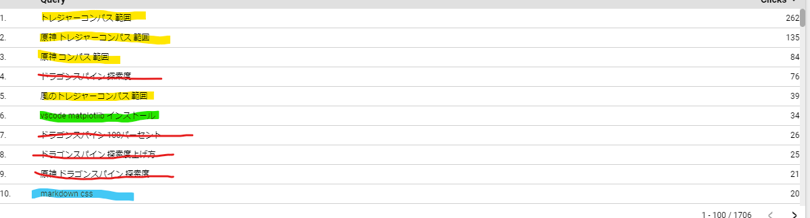

- Astroのcallout/admonition/asides
	- ((65b629aa-9d45-41b8-9ffa-ca5c12b315a0))
	- remark-admonitionは使えない
	- astro-asidesはmainブランチで削除されている
		- https://github.com/withastro/docs/blob/dacd3ca28f9343b0ee5593f686d01ffa1accc8dc/integrations/astro-asides.ts
	- remark-directiveとm2dxを組み合わせて実現した
	  background-color:: yellow
	  id:: 65d19751-4d7a-4303-b931-33bd94114295
		- https://github.com/remarkjs/remark-directive
		- https://github.com/christian-hackyourshack/npm/tree/main/packages/astro-m2dx
		- https://github.com/hachian/astro-blog/pull/1
- DONE マイクラ環境構築記事のマイグレーション
  SCHEDULED: <2024-02-25 Sun>
	- https://blog.hachian.com/blog/minecraft-programming-drawfigure/
- ブログ記事マイグレーション進捗
	- 
-