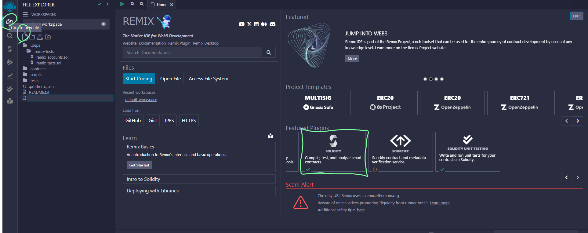

- AVALANCHE
	- [公式のチュートリアル](https://docs.avax.network/build/dapp/smart-contracts/erc-20)でトークン発行
	- テストネットのトークンが必要
	- 少量でもAVAXを持っていればテスト用の`2AVAX`もらえる
	- そうでない場合は[Guild](https://guild.xyz/avalanche)でクーポンを獲得する
		- AvalancheのDiscordに参加、初期設定をしてmemberロールになる
		- メールアドレスを登録
		- [テストネットで2AVAX獲得](https://subnets-test.avax.network/c-chain/tx/0xff190da7a01dafaccd4d1c07696980ba32e6d5f4f0db445f41136b0e6bfc3396)した
	- 
- ((65fea0bd-5a11-438d-b0fe-83ba8b587a90))
	- {{video https://youtu.be/rzCX-U02jTY}}
	- CoinToolを使用
		- Decimal 6
		- 500Mぐらい
		- 0.4SOL (+0.3)