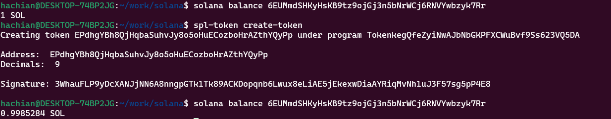

- spl-tokenコマンド
	- `curl https://sh.rustup.rs -sSf | sh`
	- `. "$HOME/.cargo/env"`
	- `sudo apt install build-essential`
	- `sudo apt install pkg-config`
	- `sudo apt-get install libudev-dev`
- solanaコマンド
	- sh -c "$(curl -sSfL https://release.solana.com/stable/install)"
- keygen
	- `solana-keygen new --outfile my_account.json`
	- ```
	  Wrote new keypair to my_account.json
	  =========================================================================
	  pubkey: 6EUMmdSHKyHsKB9tz9ojGj3n5bNrWCj6RNVYwbzyk7Rr
	  =========================================================================
	  Save this seed phrase and your BIP39 passphrase to recover your new keypair:
	  van stairs head spread alcohol foam way lunar tuition record autumn erase
	  =========================================================================
	  ```
	- `solana config set --keypair my_account.json`
	- `solana airdrop 1 6EUMmdSHKyHsKB9tz9ojGj3n5bNrWCj6RNVYwbzyk7Rr --url devnet`
	- `spl-token create-token`
	- 
	-
- add
	- solana address: `6EUMmdSHKyHsKB9tz9ojGj3n5bNrWCj6RNVYwbzyk7Rr`
	- token address: `EPdhgYBh8QjHqbaSuhvJy8o5oHuECozboHrAZthYQyPp`
	- owner address: `B9sgKecNaaaWFbqbFnr4QTo9cpchhT4JdWRnYSpyZrz`
	-