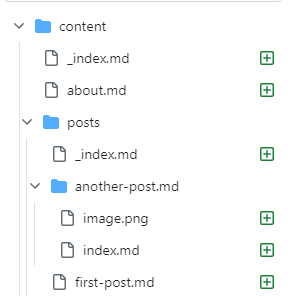

- [Blowfish](https://blowfish.page/docs/installation/)よさそう
- hugoをインストール
	- https://gohugo.io/installation/windows/
	- (PowerShellを起動)
	- `winget install Hugo.Hugo.Extended`
	- (PowerShellを再起動)
	- `hugo version`
	- > hugo **v0.128.0**-e6d2712ee062321dc2fc49e963597dd5a6157660+extended windows/amd64 BuildDate=2024-06-25T16:15:48Z VendorInfo=gohugoio
	- `v0.87.0`以上ならOK
- Blowfish Toolsをインストール
  collapsed:: true
	- #+BEGIN_CAUTION
	  Windowsだと動かない、次のGitを使った方法にする
	  #+END_CAUTION
	- (Node.jsインストール)
	- (npxインストール)
	- `npx blowfish-tools`
		- インストールはされていないかも？
	- できることは以下の動画
		- {{video https://youtu.be/SgXhGb-7QbU}}
- CLIでインストール
	- ^^以下、作りたいページを`mywebsite`とする^^
	- ```shell
	  hugo new site mywebsite
	  cd mywebsite
	  git init
	  git submodule add -b main https://github.com/nunocoracao/blowfish.git themes/blowfish
	  ```
	- .gitignoreファイルを作成、[参照](https://www.toptal.com/developers/gitignore/api/hugo,visualstudiocode)
	- `hugo.toml`を削除
	- `.\themes\blowfish\config`を`.`にコピー
	- `config\_default\hugo.toml`の`# theme = "blowfish"`をコメントアウト解除
- (ここまでInstallation、いったんコミット)
- 基本設定
	- `config\_default\hugo.toml`
		- `baseURL`に公開URLを記載
		- `defaultContentLanguage = "ja"`
	- ファイル名変更
		- `config\_default\languages.en.toml`→`config\_default\languages.ja.toml`
		- `config\_default\menus.en.toml`→`config\_default\menus.ja.toml`
	- `config\_default\languages.ja.toml`
		- 以下のような感じにする　[参照](https://raw.githubusercontent.com/nunocoracao/blowfish/main/exampleSite/config/_default/languages.ja.toml)
		  collapsed:: true
			- ```toml
			  languageCode = "ja"
			  languageName = "日本語"
			  weight = 1
			  title = "ハチアンのブログ"
			  
			  [params]
			    displayName = "日本語"
			    isoCode = "ja"
			    rtl = false
			    dateFormat = "2006-01-02"
			    # logo = "img/blowfish_logo_transparent.png"
			    description = "強力で、軽量な Hugo のテーマです。"
			  
			  [author]
			    name = "ハチアン"
			    image = "img/avatar.jpg"
			    headline = "強力で、軽量な Hugo のテーマです。"
			    bio = "強力で、軽量な Hugo のテーマです。"
			    links = [
			      { x-twitter = "https://twitter.com/burufugu" },
			      { github = "https://github.com/nunocoracao/blowfish" },
			    ]
			  ```
		- `assets\img\avatar.jpg`に画像を作成
	- menu
		- 以下のような感じにする
		  collapsed:: true
			- ```toml
			  [[main]]
			    name = "Blog"
			    pageRef = "posts"
			    weight = 10
			  
			  [[main]]
			    name = "Topics"
			    pageRef = "topics"
			    weight = 20
			  
			  [[main]]
			    pre = "github"
			    name = "GitHub"
			    url = "https://github.com/nunocoracao/blowfish"
			    weight = 30
			  
			  [[main]]
			    identifier = "github2"
			    pre = "github"
			    url = "https://github.com/nunocoracao/blowfish"
			    weight = 40
			  
			  [[footer]]
			    name = "Privacy"
			    url = "https://external-link"
			  
			  [[subnavigation]]
			    name = "An interesting topic"
			    pageRef = "tags/interesting-topic"
			    weight = 10
			  
			  [[subnavigation]]
			    name = "My Awesome Category"
			    pageRef = "categories/awesome"
			    weight = 20
			  
			  ```
- カラースキーム
	- `config\_default\params.toml`
	- `colorScheme = "blowfish"`を変える
	- たくさんあるので、選ぶ　[参照](https://blowfish.page/docs/getting-started/#colour-schemes)
- コンテンツ作成
	- 以下のようなファイルとフォルダを作成する　[参照](https://github.com/hachian/blowfish-blog/commit/0319f74a048ea795c1e64c9b339f101f28f4eff8)
	- 
- ここまでで、`hugo server`コマンドで動くようになる
- [作者の設定](https://github.com/nunocoracao/n9o.xyz/blob/main/config/_default/params.toml)