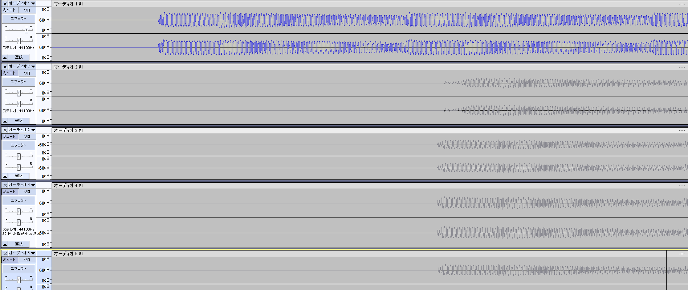

- 遅延評価
  id:: 668bdfe6-8025-431e-b8a3-82f1ef4230aa
	- 
	- 基準2418
	- 有線
		- 2750
		- 2726
		- 2722
		- 2713
		- 2730
	- DAC
		- 2751
		- 2747
		- 2745
		- 2740
		- 2742
	- スイッチャ
		- 2756
		- 2745
		- 2739
		- 2742
		- 2742
	- aptx ll
		- 2791
		- 2777
		- 2786
		- 2784
		- 2787
	- aptx ll (anc)
		- 2782
		- 2779
		- 2781
		- 2777
		- 2777
	- sbc
		- 2949
		- 2948
		- 2944
		- 2948
		- 2952
	- nova7 有線
		- 2722
		- 2719
		- 2731
		- 2726
		- 2724
	- noa7 2.4ghz
		- 2755
		- 2749
		- 2752
		- 2744
		- 2747
	- nova7 BT
		- 2998
		- 2976
		- 2975
		- 2976
		- 2977