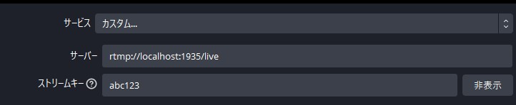
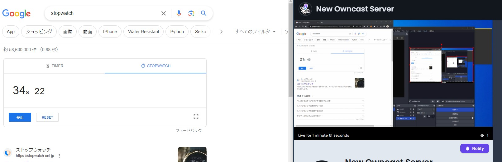

## Fediverseとは
	- Federation(連合) + Universe(世界・宇宙)
	- *サーバー同士が意思疎通*をとれる
		- サービスをまたいだフォローやメッセージが可能
	- 代表的な(有名な)Fediverseのサービス
		- Mastodon
		- Misskey
		- Bluesky
	-
	- > [Fediverse（フェディバース）は、「federation（連合）」と「universe（世界）」のかばん語で、SNS・ミニブログ・ブログなどを含むWebサイトの公開やファイルホスティングを行う、独立性を保ったまま相互接続されたサーバー群のことを指します](https://ja.wikipedia.org/wiki/Fediverse)[1](https://ja.wikipedia.org/wiki/Fediverse)[。異なるサーバー（インスタンス）それぞれにおいてユーザーがアカウントを作成し、異なるサーバーに属するアカウント同士が各サーバー上のソフトウェアが実装するオープン標準の通信プロトコルを通して通信できることが特徴です](https://ja.wikipedia.org/wiki/Fediverse)[1](https://ja.wikipedia.org/wiki/Fediverse)[。テキストなどを投稿したり他のアカウントによる投稿を購読することができます](https://ja.wikipedia.org/wiki/Fediverse)[1](https://ja.wikipedia.org/wiki/Fediverse)[。Fediverse上には動画・音声・テキストデータの単純な共有だけでなく、公開範囲の限定やアドレス帳やカレンダーなどの共同編集が可能なソフトウェアも存在します](https://ja.wikipedia.org/wiki/Fediverse)[1](https://ja.wikipedia.org/wiki/Fediverse)。
	-
	- [英語版Wikipedia](https://en.wikipedia.org/wiki/Fediverse)に詳しく書いてある
		- Fediverseの全体像
			- {:height 854, :width 686}
		- ActivityPubの仲間たち
			- 
- ## 今までのSNSとの比較
	- [[draws/2023-10-07-20-11-05.excalidraw]]
	-
- ## マイクロブログだけじゃない
	- ブログ系
		- Lemmy
		- Wordpress (Plugin)
	- 動画系
		- Peertube
		- Owncast
	- 音声
		- Castopod
- ## プロトコルたち
	- ActivityPub
	- Diaspora
	- Matrix
	- AT Protocol
- ## Owncastやってみた
	- https://owncast.online/quickstart/container/
		- 上記通りでdocker使ったインストールが可能
		- ```bash
		  docker pull owncast/owncast:latest
		  docker run -v `pwd`/data:/app/data -p 8080:8080 -p 1935:1935 -it owncast/owncast:latest
		  ```
	- https://owncast.online/quickstart/startstreaming/
		- OBS設定は上記
		- 設定→サービスをカスタムに
		- 
	- ローカル配信してみたが、遅延13秒程度
		- {:height 242, :width 717}
-