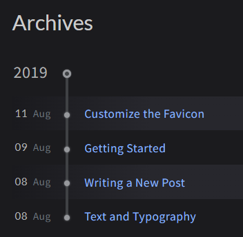
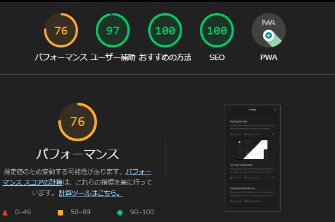
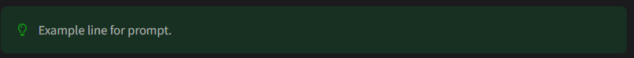
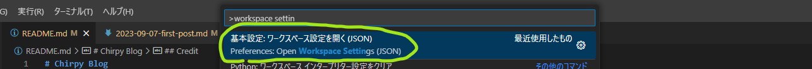

## Jekyllとは
collapsed:: true
	- Jekyllは静的サイトジェネレータ (Static Site Generator; SSG)
		- [[Markdown]]でブログが書ける
		- Rubyベース
			- `gem`とか`bundle`とか出てくる
			- Rubyはあまり詳しくない
		- [公式ページ](http://jekyllrb-ja.github.io/)
		- [構築したプロジェクト](https://github.com/hachian/chirpy-blog) #GitHub
- ## 利点
  collapsed:: true
	- 正直Jekyllが良かったわけではなく、[jekyll-theme-chirpy](https://github.com/cotes2020/jekyll-theme-chirpy)が良かった
	- Jekyll自体は成熟したプロジェクトで、メンテナンスが続いている(2023/09現在)
		- ただし、Ruby起因エラーはググってもあまり出てこない
		- (ググり方が悪い？)
	- 以下に示すブログに必要な要素がそろっていた
		- 記事一覧ページ
		- タグ機能
		- 目次
		- コードハイライト
		- コメント機能
	- ついでに以下もよい
		- アーカイブビュー(年表のような表示)
			- 
	- パフォーマンスはまあまあ
		- 
- ## 環境構築
  collapsed:: true
	- 前提
		- Windows
		- Gitインストール済み
		- vscodeインストール済み
	- ((64fbc396-d331-4ad0-9762-588bc65a3ec2))
	- #+BEGIN_WARNING
	  リポジトリ名を`USERNAME.github.io`にしないと縛りがあるので注意
	  * カスタムドメインでないGitHub Pagesで使えない
	  * GitHub Pagesにカスタムドメインを
	  * ほかのホスティングサイトを使えばOK
	  #+END_WARNING
	- 後でDeployするために変更はGitHubにあげておく
- ## 初期設定
  collapsed:: true
	- `_config.yml`で、言語とタイムゾーンを設定
		- [参考コミット](https://github.com/hachian/chirpy-blog/commit/e13faf47f0def21e7ab32a553b2646e166f03e43)
		- #+BEGIN_WARNING
		  `baseurl`は変えなくてよい
		  #+END_WARNING
	- SEO関連情報・ソーシャルリンクを設定、著者情報追加、メール問い合わせは削除
		- `_config.yml`の`title`、`tagline`、`description`あたりを編集
		- 著者情報は`_data/authors.yml`に記入
		- `_data/contact.yml`のemail部分を消せばメール問い合わせを削除できる
			- Twitter、GitHub、RSSも消せる
			- Mastodon、LinkedIn、Stack Overflowを追加することもできる
		- [参考コミット](https://github.com/hachian/chirpy-blog/commit/2b6479c66092ec4299c6fcbc767e7d083a683317)
	- フォントの変更
		- `_sass`フォルダを取ってくる
			- [jekyll-theme-chirpy](https://github.com/cotes2020/jekyll-theme-chirpy)から[chirpy-starter](https://github.com/cotes2020/chirpy-starter)と同じバージョンの`_sass`フォルダを取ってくる
			- ((64fbffa2-ee11-4c64-995e-76d8fd848ab5))
			- 自分のプロジェクトに置く
			- `_sass/variables-hook.scss`を変更
				- ```scss
				  $font-family-base: 'Kosugi Maru', 'Source Sans Pro', 'Microsoft Yahei', sans-serif;
				  $font-family-heading: 'Kosugi Maru', Lato, 'Microsoft Yahei', sans-serif;
				  ```
		- Google Fontsを使えるようにする
			- `_data/origin/cors.yml`を取ってくる
			- `_sass`と同様にmasterはNGなので、所望のバージョンを取ってくる
			- 以下を参考に変更
				- ```diff
				   # fonts
				  
				  -webfonts: https://fonts.googleapis.com/css2?family=Lato&family=Source+Sans+Pro:wght@400;600;700;900&display=swap
				  +webfonts: https://fonts.googleapis.com/css2?family=Kosugi+Maru&family=Lato&family=Source+Sans+Pro:wght@400;600;700;900&display=swap
				   
				   # Libraries
				  ```
		- before/after
			- ((64fc064d-7cfd-41b1-a77a-a09167fe3071))
	-
- ## 記事作成
  collapsed:: true
	- `_posts`フォルダの中に`YYYY-MM-DD-name.md`形式のファイルを作成する
	- フロントマターを記載する
		- 例
		- ```md
		  ---
		  title: first post
		  date: 2023-09-07 23:31
		  categories: [test]
		  tags: [test]
		  author: hachian
		  math: true
		  ---
		  ```
	- [[Markdown]]で記事を書く
		- 引用の後に`{: .prompt-tip}`などと記載するとadmonitionが表現できる
		- ```md
		  > Example line for prompt.
		  {: .prompt-tip }
		  ```
		- 
	- 画像は`assets`フォルダ以下に配置することにした。
- ## Visual Studio Code設定 #vscode
  collapsed:: true
	- 画像貼り付け
		- vscode1.79から拡張機能なしで[Markdownに画像を張り付けられるようになった](https://code.visualstudio.com/updates/v1_79#_copy-external-media-files-into-workspace-on-drop-or-paste-for-markdown)
		- そのままだと`*.md`ファイルと同じディレクトリに画像が生成されるため、以下の設定尾を行う
			- コマンドパレットからワークスペース設定を開く
			- 
			- `.vscode\settings.json`ファイルが生成される
			- ```json
			  {
			      "markdown.copyFiles.destination": {
			          "**/*.md": "${documentWorkspaceFolder}/assets/img/${documentBaseName}/"
			      }
			  }
			  ```
			- 貼り付け先は相対パスになってしまうため適宜手作業で修正
				- 修正前：``
				- 修正前：``
				- vscodeで対応してほしい。。
- ## [[Cloudflare]] Pagesにデプロイ
  collapsed:: true
	- [公式](https://developers.cloudflare.com/pages/framework-guides/deploy-a-jekyll-site/)を参考にする
	- CloudflareのWorkers & PagesからPages→Connect to Git
		- ((64fbc396-1797-41b7-a742-8bde339bcf95))
		- GitHubのアカウントとCloudflareのアカウントをリンクする。
	- 以下の通り設定
		- Production branch: `main`
		- Build command: `jekyll build --future`
			- `--future`オプションは未来の記事もビルドする
		- Build output directory: `/_site`
	- Build失敗
		- 以下のような失敗が起こる
			- ```
			  21:48:09.660	/opt/buildhome/.asdf/installs/ruby/3.2.2/lib/ruby/gems/3.2.0/gems/bundler-2.4.19/lib/bundler/definition.rb:540:in `materialize': Could not find html-proofer-3.19.4, nokogiri-1.15.4-x86_64-linux, parallel-1.23.0, rainbow-3.1.1, typhoeus-1.4.0, yell-2.2.2, racc-1.7.1, ethon-0.16.0 in locally installed gems (Bundler::GemNotFound)
			  21:48:09.660		from /opt/buildhome/.asdf/installs/ruby/3.2.2/lib/ruby/gems/3.2.0/gems/bundler-2.4.19/lib/bundler/definition.rb:200:in `specs'
			  21:48:09.661		from /opt/buildhome/.asdf/installs/ruby/3.2.2/lib/ruby/gems/3.2.0/gems/bundler-2.4.19/lib/bundler/definition.rb:266:in `specs_for'
			  21:48:09.661		from /opt/buildhome/.asdf/installs/ruby/3.2.2/lib/ruby/gems/3.2.0/gems/bundler-2.4.19/lib/bundler/runtime.rb:18:in `setup'
			  21:48:09.661		from /opt/buildhome/.asdf/installs/ruby/3.2.2/lib/ruby/gems/3.2.0/gems/bundler-2.4.19/lib/bundler.rb:162:in `setup'
			  21:48:09.661		from /opt/buildhome/.asdf/installs/ruby/3.2.2/lib/ruby/gems/3.2.0/gems/jekyll-4.3.2/lib/jekyll/plugin_manager.rb:52:in `require_from_bundler'
			  21:48:09.662		from /opt/buildhome/.asdf/installs/ruby/3.2.2/lib/ruby/gems/3.2.0/gems/jekyll-4.3.2/exe/jekyll:11:in `<top (required)>'
			  21:48:09.662		from /opt/buildhome/.asdf/installs/ruby/3.2.2/bin/jekyll:25:in `load'
			  21:48:09.662		from /opt/buildhome/.asdf/installs/ruby/3.2.2/bin/jekyll:25:in `<main>'
			  ```
			- `html-proofer-3.19.4`が見つからないみたいなエラー
			- `Gemfile`から`html-proofer`を消す
				- [参考コミット](https://github.com/hachian/chirpy-blog/commit/46346d278baa52909e7cb698eced4d269ffc142f)
				- 7,9行目を削除するだけでよかったかも
	- デプロイが成功すれば、Visit siteからブログへアクセスできるはず
- ## jekyll-theme-chirpyのupdate
	- GitHubリポジトリの[Upgrade Guide](https://github.com/cotes2020/jekyll-theme-chirpy/wiki/Upgrade-Guide)に従う
	- chirpy-starterだけではなく、[メインリポジトリ](https://github.com/cotes2020/jekyll-theme-chirpy)の変更も取り込む
		- [_data/origin/cors.yml](https://github.com/cotes2020/jekyll-theme-chirpy/blob/master/_data/origin/cors.yml)の差分を取り込む
			- カスタマイズしている`webfonts`だけキープする
		- [_sass](https://github.com/cotes2020/jekyll-theme-chirpy/tree/master/_sass)の差分を取り込む
			- カスタマイズしている`_sass/variables-hook.scss`だけキープする
	- [assets/lib](https://github.com/cotes2020/chirpy-starter/tree/main/assets)もgit-submoduleからコミットハッシュを合わせる